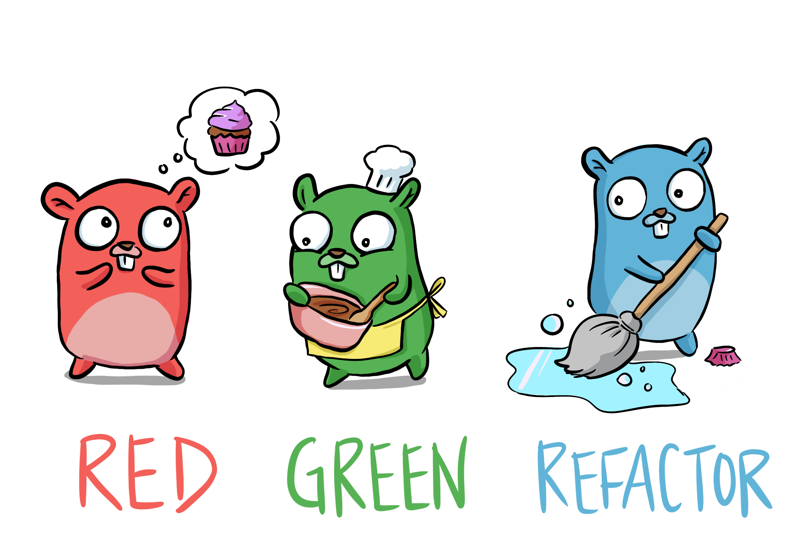

# تعلّم Go بالاختبارات

<p align="center">
  
</p>

الرسم من [Denise](https://github.com/deniseyu)

الترجمة العربية لكتاب [Learn Go with Tests](https://github.com/quii/learn-go-with-tests)
للمؤلف [Chris James](https://github.com/quii).

**[اقرأ الكتاب من هنا](https://zeyadsleem.github.io/learn-go-with-tests-ar/)**

## عن الكتاب

يعلّم الكتاب لغة Go من خلال كتابة الاختبارات، مع تركيز على التطوير الموجه
بالاختبار (TDD). يبدأ كل فصل باختبار فاشل ونسير خطوة بخطوة حتى يعمل الكود،
ثم نعيد ترتيبه (refactor) بثقة، لأن الاختبارات تحمينا.

## حالة الترجمة

الترجمة العربية تغطي كل فصول الكتاب الأصلية، مع الحفاظ على أمثلة الكود كما هي
بالضبط، وروابطها تشير إلى [المستودع الأصلي](https://github.com/quii/learn-go-with-tests).

مزايا الموقع: عرض كامل من اليمين إلى اليسار، وتلوين لأكواد Go، ووضعان فاتح
وغامق، وقراءة الصفحات دون اتصال بعد أول زيارة.

## فهرس الكتاب

### أساسيات Go

1. [تثبيت Go وتجهيز بيئة عمل منتجة](content/docs/go-fundamentals/install-go.md)
2. [مرحبًا بالعالم](content/docs/go-fundamentals/hello-world.md)
3. [الأعداد الصحيحة](content/docs/go-fundamentals/integers.md)
4. [التكرار](content/docs/go-fundamentals/iteration.md)
5. [المصفوفات والشرائح](content/docs/go-fundamentals/arrays-and-slices.md)
6. [Structs والـ Methods والـ Interfaces](content/docs/go-fundamentals/structs-methods-and-interfaces.md)
7. [المؤشرات والأخطاء](content/docs/go-fundamentals/pointers-and-errors.md)
8. [الـ Maps](content/docs/go-fundamentals/maps.md)
9. [حقن الاعتماديات](content/docs/go-fundamentals/dependency-injection.md)
10. [الـ Mocking](content/docs/go-fundamentals/mocking.md)
11. [التزامن (Concurrency)](content/docs/go-fundamentals/concurrency.md)
12. [الـ Select](content/docs/go-fundamentals/select.md)
13. [الـ Reflection](content/docs/go-fundamentals/reflection.md)
14. [الـ Sync](content/docs/go-fundamentals/sync.md)
15. [الـ Context](content/docs/go-fundamentals/context.md)
16. [مقدمة إلى الاختبارات القائمة على الخصائص](content/docs/go-fundamentals/roman-numerals.md)
17. [الرياضيات](content/docs/go-fundamentals/math/index.md)
18. [قراءة الملفات](content/docs/go-fundamentals/reading-files.md)
19. [القوالب](content/docs/go-fundamentals/html-templates.md)
20. [الـ Generics](content/docs/go-fundamentals/generics.md)
21. [إعادة زيارة المصفوفات والشرائح مع الـ Generics](content/docs/go-fundamentals/revisiting-arrays-and-slices-with-generics.md)

### أساسيات الاختبار

* [مقدمة إلى اختبارات القبول](content/docs/testing-fundamentals/intro-to-acceptance-tests.md)
* [توسيع نطاق اختبارات القبول](content/docs/testing-fundamentals/scaling-acceptance-tests.md)
* [العمل بدون الـ Mocks والـ Stubs والـ Spies](content/docs/testing-fundamentals/working-without-mocks.md)
* [قائمة تحقق إعادة الهيكلة](content/docs/testing-fundamentals/refactoring-checklist.md)

### بناء تطبيق

* [مقدمة](content/docs/build-an-application/app-intro.md)
* [خادم HTTP](content/docs/build-an-application/http-server.md)
* [JSON والتوجيه والدمج](content/docs/build-an-application/json.md)
* [الـ IO والترتيب](content/docs/build-an-application/io.md)
* [سطر الأوامر وهيكل المشروع](content/docs/build-an-application/command-line.md)
* [الوقت](content/docs/build-an-application/time.md)
* [إعادة زيارة الوقت مع testing/synctest](content/docs/build-an-application/revisiting-time-with-synctest.md)
* [الـ WebSockets](content/docs/build-an-application/websockets.md)

### أسئلة وأجوبة

* [تنفيذ أوامر النظام (OS Exec)](content/docs/questions-and-answers/os-exec.md)
* [أنواع الأخطاء](content/docs/questions-and-answers/error-types.md)
* [قارئ يراعي الـ Context](content/docs/questions-and-answers/context-aware-reader.md)
* [إعادة زيارة معالجات HTTP](content/docs/questions-and-answers/http-handlers-revisited/index.md)

### مواضيع أخرى

* [لماذا اختبارات الوحدة وكيف تجعلها تعمل لصالحك](content/docs/meta/why.md)
* [الأنماط المضادة (Anti-patterns)](content/docs/meta/anti-patterns.md)
* [المساهمة](content/docs/meta/contributing.md)
* [قالب الفصل](content/docs/meta/template.md)

## المساهمة

المساهمات مرحّب بها، سواء في تصحيح ترجمة موجودة أو تحسين الصياغة.
افتح Issue أو أرسل Pull Request مباشرة.

## البناء محليًا

المشروع مبني بـ [Hugo](https://gohugo.io) وثيم [Hugo Book](https://github.com/alex-shpak/hugo-book).

```sh
git clone --recursive https://github.com/zeyadsleem/learn-go-with-tests-ar.git
cd learn-go-with-tests-ar
hugo server
```

سيفتح الموقع على `http://localhost:1313`.

## الترخيص والإسناد

كل المحتوى مشتق من كتاب [Learn Go with Tests](https://github.com/quii/learn-go-with-tests)
للمؤلف Chris James، والكود الأصلي والشرح منشوران تحت [ترخيص MIT](LICENSE.md).
وتشير روابط الكود في الفصول إلى المستودع الأصلي.

الترجمة العربية منشورة بالترخيص نفسه، والحقوق محفوظة لمترجميها.
