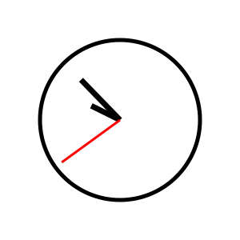
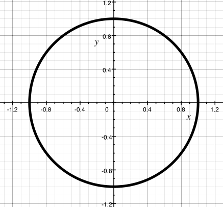
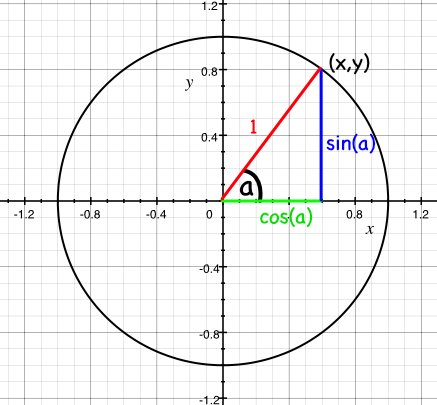
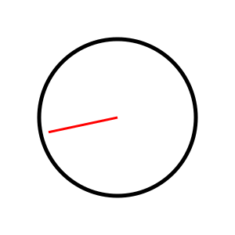
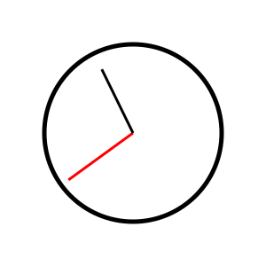
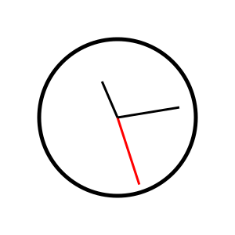

# الرياضيات

**[يمكنك العثور على كل كود هذا الفصل هنا](https://github.com/quii/learn-go-with-tests/tree/main/math)**

مهما بلغت قوة الحواسيب الحديثة في إجراء عمليات جمع هائلة بسرعة البرق، فنادرًا ما يستخدم المطور العادي أي رياضيات في عمله. لكن ليس اليوم! سنستخدم اليوم الرياضيات لحل مشكلة _حقيقية_. وليست رياضيات مملة - سنستخدم حساب المثلثات والمتجهات وكل تلك الأشياء التي كنت تقول دائمًا إنك لن تحتاج إليها بعد الثانوية.

## المشكلة

تريد أن تصنع صورة SVG لساعة. لا ساعة رقمية - لا، فتلك ستكون سهلة - بل ساعة _عقارب_، لها عقارب. ولا تبحث عن شيء فخم، فقط دالة لطيفة تأخذ `Time` من حزمة `time` وتُخرج SVG لساعة بكل عقاربها - الساعات والدقائق والثواني - مشيرة في الاتجاه الصحيح. فما مدى صعوبة ذلك؟

أولًا سنحتاج إلى صورة SVG لساعة لنلهو بها. فصور SVG صيغة صور رائعة للتعامل البرمجي، لأنها مكتوبة كسلسلة من الأشكال موصوفة بـ XML. فهذه الساعة:



تُوصف هكذا:

```xml
<?xml version="1.0" encoding="UTF-8" standalone="no"?>
<!DOCTYPE svg PUBLIC "-//W3C//DTD SVG 1.1//EN" "http://www.w3.org/Graphics/SVG/1.1/DTD/svg11.dtd">
<svg xmlns="http://www.w3.org/2000/svg"
     width="300"
     height="300"
     viewBox="0 0 300 300"
     version="2.0">

  <!-- bezel -->
  <circle cx="150" cy="150" r="100" style="fill:#fff;stroke:#000;stroke-width:5px;"/>

  <!-- hour hand -->
  <line x1="150" y1="150" x2="114.150000" y2="132.260000"
        style="fill:none;stroke:#000;stroke-width:7px;"/>

  <!-- minute hand -->
  <line x1="150" y1="150" x2="101.290000" y2="99.730000"
        style="fill:none;stroke:#000;stroke-width:7px;"/>

  <!-- second hand -->
  <line x1="150" y1="150" x2="77.190000" y2="202.900000"
        style="fill:none;stroke:#f00;stroke-width:3px;"/>
</svg>
```

إنها دائرة بثلاثة خطوط، يبدأ كل خط من مركز الدائرة (x=150, y=150) وينتهي على مسافة ما.

فما سنفعله هو إعادة بناء ما سبق بطريقة ما، لكن مع تغيير الخطوط لتصبح مشيرة في الاتجاهات المناسبة لوقت معين.

## اختبار القبول

قبل أن نغرق في التفاصيل، لنفكر في اختبار القبول.

مهلًا، أنت لا تعرف بعد ما اختبار القبول. انظر، دعني أحاول الشرح.

دعني أسألك: كيف يبدو النجاح؟ كيف نعرف أننا انتهينا من العمل؟ يمنحنا TDD طريقة جيدة لمعرفة متى انتهينا: عندما ينجح الاختبار. وأحيانًا يكون من الجميل - بل في الواقع، في كل الأوقات تقريبًا يكون من الجميل - أن تكتب اختبارًا يخبرك بأنك انتهيت من كتابة الميزة كاملة وقابلة للاستخدام. لا مجرد اختبار يخبرك أن دالة معينة تعمل كما تتوقع، بل اختبار يخبرك أن كل ما تحاول تحقيقه - أي "الميزة" - قد اكتمل.

تُسمى هذه الاختبارات أحيانًا "اختبارات القبول"، وأحيانًا "اختبارات الميزات" (feature tests). والفكرة أنك تكتب اختبارًا عالي المستوى لتصف ما تحاول تحقيقه - ينقر مستخدم على زر في موقع، فيرى قائمة كاملة بكل الـ Pokémon التي اصطادها، على سبيل المثال. وبعد أن نكتب ذلك الاختبار، يمكننا كتابة مزيد من الاختبارات - اختبارات الوحدة - التي تبني نحو نظام يعمل وسينجح في اختبار القبول. ففي مثالنا قد تكون هذه الاختبارات عن عرض صفحة ويب فيها زر، واختبار معالجات المسارات (route handlers) في خادم ويب، وإجراء استعلامات في قاعدة بيانات، وهكذا. وكل هذه الأشياء ستُبنى بـ TDD، وكلها ستسهم في جعل اختبار القبول الأصلي ينجح.

شيء كهذه الصورة _الكلاسيكية_ لـ Nat Pryce وSteve Freeman


على أي حال، لنحاول كتابة اختبار القبول ذلك - الذي سيخبرنا متى ننتهي.

لدينا ساعة كمثال، فلنفكر في البارامترات المهمة التي سنحتاج إليها.

```
<line x1="150" y1="150" x2="114.150000" y2="132.260000"
        style="fill:none;stroke:#000;stroke-width:7px;"/>
```

مركز الساعة (السمتان `x1` و`y1` لهذا الخط) واحد في كل عقرب من عقارب الساعة. أما الأرقام التي تحتاج إلى تغيّر لكل عقرب - أي البارامترات التي يتلقاها أي شيء يبني الـ SVG - فهي السمتان `x2` و`y2`. وسنحتاج إلى X وY لكل عقرب من عقارب الساعة.

_كان بإمكاني_ التفكير في مزيد من البارامترات - نصف قطر دائرة وجه الساعة، وحجم الـ SVG، وألوان العقارب، وأشكالها، وهكذا... لكن من الأفضل أن نبدأ بحل مشكلة بسيطة ومحددة بحل بسيط ومحدد، ثم نبدأ بإضافة البارامترات لجعله عامًا.

إذن سنقول إن:

* كل ساعة مركزها (150, 150)
* طول عقرب الساعات 50
* طول عقرب الدقائق 80
* طول عقرب الثواني 90.

ومن الأمور التي ينبغي ملاحظتها في SVG: أن نقطة الأصل - أي النقطة (0,0) - تقع في الزاوية العليا _اليسرى_، لا في الزاوية السفلى اليسرى كما قد نتوقع. وسيكون من المهم تذكّر ذلك عندما نحسب أي الأرقام سنضع في خطوطنا.

وأخيرًا، أنا لا أقرر _كيف_ نبني الـ SVG - يمكننا استخدام قالب من حزمة [`text/template`](https://golang.org/pkg/text/template/)، أو يمكننا ببساطة إرسال وحدات البايت إلى `bytes.Buffer` أو إلى writer. لكننا نعلم أننا سنحتاج إلى تلك الأرقام، فلنركّز على اختبار شيء ينتجها.

### اكتب الاختبار أولًا

إذن اختباري الأول يبدو هكذا:

```go
package clockface_test

import (
	"projectpath/clockface"
	"testing"
	"time"
)

func TestSecondHandAtMidnight(t *testing.T) {
	tm := time.Date(1337, time.January, 1, 0, 0, 0, 0, time.UTC)

	want := clockface.Point{X: 150, Y: 150 - 90}
	got := clockface.SecondHand(tm)

	if got != want {
		t.Errorf("Got %v, wanted %v", got, want)
	}
}
```

`projectpath` هنا عنصر نائب (placeholder) - استبدله بمسار وحدتك (module) يليه `/clockface` (فمثلًا إذا كان ملف `go.mod` لديك يقول `module example.com/learning-go` فسيكون هذا الاستيراد `"example.com/learning-go/clockface"`). وهذا ينجح لأننا نضع `clockface_test.go` في مجلد خاص به اسمه `clockface`، بجوار `clockface.go` (الذي سننشئه بعد قليل). فتسمية المجلد مطابقًا لاسم الحزمة التي يحتويها تعني أن Go تستطيع حل الاستيراد دون حاجة إلى اسم مستعار. أما `package clockface_test` داخل المجلد نفسه فهي حالة خاصة تسمح بها Go: حزمة اختبار خارجية يمكن أن توجد بجوار ملفات `package clockface` في المجلد نفسه.

أتذكر كيف ترسم SVG إحداثياتها انطلاقًا من الزاوية العليا اليسرى؟ لوضع عقرب الثواني عند منتصف الليل، نتوقع أنه لم يتحرك من مركز وجه الساعة على المحور X - أي ما زال 150 - بينما المحور Y هو طول العقرب "أعلى" المركز؛ أي 150 ناقص 90.

### جرّب تشغيل الاختبار

هذا يُظهر الإخفاقات المتوقعة بشأن الدوال والأنواع الناقصة:

```
--- FAIL: TestSecondHandAtMidnight (0.00s)
./clockface_test.go:13:10: undefined: clockface.Point
./clockface_test.go:14:9: undefined: clockface.SecondHand
```

إذن نحتاج إلى `Point` حيث ينبغي أن تقع نهاية عقرب الثواني، ودالة للحصول عليه.

### اكتب أصغر قدر من الكود ليعمل الاختبار وافحص مخرجاته الفاشلة

لنُنفّذ هذين النوعين ليعمل الكود:

```go
package clockface

import "time"

// A Point represents a two-dimensional Cartesian coordinate
type Point struct {
	X float64
	Y float64
}

// SecondHand is the unit vector of the second hand of an analogue clock at time `t`
// represented as a Point.
func SecondHand(t time.Time) Point {
	return Point{}
}
```

والآن نحصل على:

```
--- FAIL: TestSecondHandAtMidnight (0.00s)
    clockface_test.go:17: Got {0 0}, wanted {150 60}
FAIL
exit status 1
FAIL	learn-go-with-tests/math/clockface	0.006s
```

### اكتب كودًا كافيًا لنجاح الاختبار

عندما نحصل على الإخفاق المتوقع، يمكننا ملء قيمة الإرجاع في `SecondHand`:

```go
// SecondHand is the unit vector of the second hand of an analogue clock at time `t`
// represented as a Point.
func SecondHand(t time.Time) Point {
	return Point{150, 60}
}
```

ها هو ذا، اختبار ناجح.

```
PASS
ok  	    clockface	0.006s
```

### إعادة الهيكلة

لا حاجة إلى إعادة الهيكلة بعد - فالكود بالكاد موجود!

### كرّر مع متطلبات جديدة

سنحتاج على الأرجح إلى عمل شيء هنا لا يقتصر على إرجاع ساعة تعرض منتصف الليل في كل وقت...

### اكتب الاختبار أولًا

```go
func TestSecondHandAt30Seconds(t *testing.T) {
	tm := time.Date(1337, time.January, 1, 0, 0, 30, 0, time.UTC)

	want := clockface.Point{X: 150, Y: 150 + 90}
	got := clockface.SecondHand(tm)

	if got != want {
		t.Errorf("Got %v, wanted %v", got, want)
	}
}
```

نفس الفكرة، لكن عقرب الثواني الآن يشير _إلى الأسفل_، لذا _نجمع_ الطول إلى المحور Y.

سيعمل هذا في الترجمة... لكن كيف نجعله ينجح؟

## وقت التفكير

كيف سنحل هذه المشكلة؟

كل دقيقة يمر عقرب الثواني بالحالات الستين نفسها، مشيرًا في 60 اتجاهًا مختلفًا. فعند الثانية 0 يشير إلى أعلى وجه الساعة، وعند الثانية 30 يشير إلى أسفله. سهل بما يكفي.

فلو أردت التفكير في الاتجاه الذي كان عقرب الثواني يشير إليه عند، لنقل، الثانية 37، فسأريد الزاوية بين الساعة 12 و37/60 من الدورة حول الدائرة. وهذه بالدرجات تساوي `(360 / 60 ) * 37 = 222`، لكن الأسهل أن نتذكر أنها `37/60` من دورة كاملة.

لكن الزاوية نصف القصة فقط؛ نحتاج إلى معرفة الإحداثيين X وY الذي تشير إليهما نهاية عقرب الثواني. فكيف نحسب ذلك؟

## الرياضيات

تخيّل دائرة نصف قطرها 1 مرسومة حول نقطة الأصل - أي الإحداثي `0, 0`.



وتُسمى "دائرة الوحدة" لأن... حسنًا، لأن نصف قطرها وحدة واحدة!

يتكوّن محيط الدائرة من نقاط على الشبكة - أي إحداثيات أخرى. ويشكّل المكوّنان x وy لكل من هذه الإحداثيات مثلثًا، يكون وتره دائمًا 1 (أي نصف قطر الدائرة).


الآن، سيتيح لنا حساب المثلثات حساب طولي X وY لكل مثلث إذا عرفنا الزاوية التي يصنعها مع نقطة الأصل. فيكون الإحداثي X هو cos(a)، والإحداثي Y هو sin(a)، حيث a هي الزاوية بين الخط والمحور x (الموجب).



(إن لم تصدّق ذلك، [اذهب وانظر في ويكيبيديا...](https://en.wikipedia.org/wiki/Sine#Unit_circle_definition))

ولمسة أخيرة - لأننا نريد قياس الزاوية انطلاقًا من الساعة 12 لا من المحور X (الساعة 3)، فعلينا تبديل المحورين؛ فيصبح x = sin(a) و y = cos(a).


الآن صرنا نعرف كيف نحصل على زاوية عقرب الثواني (1/60 من الدائرة لكل ثانية) وعلى الإحداثيين X وY. وسنحتاج إلى دالتين، لإيجاد `sin` و`cos`.

## `math`

لحسن الحظ، تحتوي حزمة `math` في Go على الاثنتين، مع عقبة صغيرة علينا استيعابها؛ فإذا نظرنا إلى وصف [`math.Cos`](https://golang.org/pkg/math/#Cos):

> تُرجع Cos جيب التمام للوسيط x بالراديان.

إنها تريد الزاوية بالراديان. فما الراديان؟ بدلًا من تعريف دورة كاملة في الدائرة بأنها 360 درجة، نعرّف الدورة الكاملة بأنها 2π راديان. وهناك أسباب وجيهة لذلك لن ندخل فيها.

وبعد أن قرأنا قليلًا وتعلّمنا قليلًا وفكّرنا قليلًا، يمكننا كتابة اختبارنا التالي.

### اكتب الاختبار أولًا

كل هذه الرياضيات صعبة ومحيّرة. ولستُ واثقًا من فهمي لما يجري - فلنكتب اختبارًا! لا نحتاج إلى حل المشكلة كلها دفعة واحدة - بل لنبدأ بحساب الزاوية الصحيحة، بالراديان، لعقرب الثواني عند وقت معين.

سأقوم _بتعليق_ اختبار القبول الذي كنت أعمل عليه أثناء عملي على هذه الاختبارات - لا أريد أن يشوّش عليّ ذلك الاختبار بينما أجعل هذا ينجح.

### مراجعة سريعة عن الحزم

في اللحظة الحالية، اختبارات القبول لدينا في حزمة `clockface_test`. ويمكن لاختباراتنا أن تكون خارج حزمة `clockface` - فطالما ينتهي اسمها بـ `_test.go` يمكن تشغيلها.

سأكتب اختبارات الراديان هذه _داخل_ حزمة `clockface`؛ فقد لا تُصدَّر أبدًا، وقد تُحذف (أو تُنقل) بمجرد أن تتحسن سيطرتي على ما يجري. وسأعيد تسمية ملف اختبار القبول إلى `clockface_acceptance_test.go`، حتى أستطيع إنشاء ملف _جديد_ اسمه `clockface_test` لاختبار الثواني بالراديان.

```go
package clockface

import (
	"math"
	"testing"
	"time"
)

func TestSecondsInRadians(t *testing.T) {
	thirtySeconds := time.Date(312, time.October, 28, 0, 0, 30, 0, time.UTC)
	want := math.Pi
	got := secondsInRadians(thirtySeconds)

	if want != got {
		t.Fatalf("Wanted %v radians, but got %v", want, got)
	}
}
```

هنا نختبر أن مرور 30 ثانية على الدقيقة ينبغي أن يضع عقرب الثواني في منتصف الطريق حول الساعة. وهذا أول استخدام لنا لحزمة `math`! فإذا كانت الدورة الكاملة في الدائرة 2π راديان، نعرف أن منتصف الطريق ينبغي أن يكون π راديان فقط. وتوفر لنا `math.Pi` قيمة لـ π.

### جرّب تشغيل الاختبار

```
./clockface_test.go:12:9: undefined: secondsInRadians
```

### اكتب أصغر قدر من الكود ليعمل الاختبار وافحص مخرجاته الفاشلة

```go
func secondsInRadians(t time.Time) float64 {
	return 0
}
```

```
clockface_test.go:15: Wanted 3.141592653589793 radians, but got 0
```

### اكتب كودًا كافيًا لنجاح الاختبار

```go
func secondsInRadians(t time.Time) float64 {
	return math.Pi
}
```

```
PASS
ok  	clockface	0.011s
```

### إعادة الهيكلة

لا شيء يحتاج إلى إعادة هيكلة بعد.

### كرّر مع متطلبات جديدة

يمكننا الآن توسيع الاختبار ليغطي بضع حالات أخرى. سأتقدم قليلًا في الخطوات وأعرض بعض كود الاختبار بعد إعادة هيكلته - وينبغي أن يكون واضحًا بما يكفي كيف وصلت إلى ما أردت.

```go
func TestSecondsInRadians(t *testing.T) {
	cases := []struct {
		time  time.Time
		angle float64
	}{
		{simpleTime(0, 0, 30), math.Pi},
		{simpleTime(0, 0, 0), 0},
		{simpleTime(0, 0, 45), (math.Pi / 2) * 3},
		{simpleTime(0, 0, 7), (math.Pi / 30) * 7},
	}

	for _, c := range cases {
		t.Run(testName(c.time), func(t *testing.T) {
			got := secondsInRadians(c.time)
			if got != c.angle {
				t.Fatalf("Wanted %v radians, but got %v", c.angle, got)
			}
		})
	}
}
```

أضفت دالتين مساعدتين لجعل كتابة هذا الاختبار القائم على الجدول أقل مللًا. فـ `testName` تحوّل الوقت إلى صيغة ساعة رقمية (HH:MM:SS)، و`simpleTime` تنشئ `time.Time` باستخدام الأجزاء التي تهمنا فعلًا فقط (وهي الساعات والدقائق والثواني مجددًا). وهما هنا:

```go
func simpleTime(hours, minutes, seconds int) time.Time {
	return time.Date(312, time.October, 28, hours, minutes, seconds, 0, time.UTC)
}

func testName(t time.Time) string {
	return t.Format("15:04:05")
}
```

ينبغي أن تساعد هاتان الدالتان في جعل هذه الاختبارات (والاختبارات المستقبلية) أسهل قليلًا في الكتابة والصيانة.

وهذا يمنحنا مخرجات اختبار لطيفة:

```
clockface_test.go:24: Wanted 0 radians, but got 3.141592653589793

clockface_test.go:24: Wanted 4.71238898038469 radians, but got 3.141592653589793
```

حان الوقت لتنفيذ كل تلك الرياضيات التي كنا نتحدث عنها أعلاه:

```go
func secondsInRadians(t time.Time) float64 {
	return float64(t.Second()) * (math.Pi / 30)
}
```

الثانية الواحدة تساوي (2π / 60) راديان... وباختصار الـ 2 نحصل على π/30 راديان. وبضرب ذلك في عدد الثواني (كـ `float64`) ينبغي أن تنجح كل الاختبارات الآن...

```
clockface_test.go:24: Wanted 3.141592653589793 radians, but got 3.1415926535897936
```

مهلًا، ماذا؟

### الأعداد العشرية مروّعة

حساب الفاصلة العائمة (floating point) [غير دقيق بشكل مشهور](https://0.30000000000000004.com/). فالحواسيب لا تتعامل حقًا إلا مع الأعداد الصحيحة، ومع الأعداد النسبية إلى حد ما. وتبدأ الأعداد العشرية في فقدان الدقة، خصوصًا عندما نضربها ونقسمها كما نفعل في دالة `secondsInRadians`. فبقسمة `math.Pi` على 30 ثم ضربها في 30 انتهينا إلى _عدد لم يعد مساويًا لـ `math.Pi`_.

وهناك طريقتان للتعامل مع هذا:

1. أن نتقبله ونتعايش معه
2. أن نعيد هيكلة دالتنا بإعادة هيكلة معادلتنا

قد لا تبدو الطريقة (1) جذابة كثيرًا، لكنها غالبًا السبيل الوحيد لجعل مساواة الأعداد العشرية تعمل. فعدم الدقة بجزء متناهٍ في الصغر لن يهم فعلًا لأغراض رسم وجه ساعة، لذا يمكننا كتابة دالة تعرّف تساويًا "قريبًا بما يكفي" لزوايانا. لكن هناك طريقة بسيطة لاستعادة الدقة: أن نعيد ترتيب المعادلة بحيث لا نقسم ثم نضرب، بل نجعلها كلها قسمة.

فبدلًا من

```
numberOfSeconds * π / 30
```

يمكننا كتابة

```
π / (30 / numberOfSeconds)
```

وهو ما يكافئها.

وفي Go:

```go
func secondsInRadians(t time.Time) float64 {
	return (math.Pi / (30 / (float64(t.Second()))))
}
```

ونحصل على النجاح.

```
PASS
ok      clockface     0.005s
```

ينبغي أن يبدو كل ذلك [شيئًا كهذا](https://github.com/quii/learn-go-with-tests/tree/main/math/v3/clockface).

### ملاحظة عن القسمة على صفر

كثيرًا ما لا تحب الحواسيب القسمة على صفر، لأن اللانهاية غريبة بعض الشيء.

في Go، إذا حاولت القسمة على صفر صراحة فستحصل على خطأ في الترجمة.

```go
package main

import (
	"fmt"
)

func main() {
	fmt.Println(10.0 / 0.0) // fails to compile
}
```

ومن الواضح أن المترجم لا يستطيع دائمًا التنبؤ بأنك ستقسم على صفر، كما في `t.Second()` لدينا.

جرّب هذا

```go
func main() {
	fmt.Println(10.0 / zero())
}

func zero() float64 {
	return 0.0
}
```

سيطبع `+Inf` (اللانهاية). ويبدو أن القسمة على +Inf تنتج صفرًا، ويمكننا رؤية ذلك في ما يلي:

```go
package main

import (
	"fmt"
	"math"
)

func main() {
	fmt.Println(secondsinradians())
}

func zero() float64 {
	return 0.0
}

func secondsinradians() float64 {
	return (math.Pi / (30 / (float64(zero()))))
}
```

### كرّر مع متطلبات جديدة

إذن غطّينا الجزء الأول هنا - صرنا نعرف الزاوية التي سيشير إليها عقرب الثواني بالراديان. والآن نحتاج إلى حساب الإحداثيات.

ومرة أخرى، لنجعل الأمر بسيطًا قدر الإمكان ولنعمل فقط مع _دائرة الوحدة_؛ الدائرة التي نصف قطرها 1. وهذا يعني أن كل عقاربنا سيكون طولها واحدًا، لكن الجانب المشرق أن الرياضيات ستصبح سهلة الهضم.

### اكتب الاختبار أولًا

```go
func TestSecondHandPoint(t *testing.T) {
	cases := []struct {
		time  time.Time
		point Point
	}{
		{simpleTime(0, 0, 30), Point{0, -1}},
	}

	for _, c := range cases {
		t.Run(testName(c.time), func(t *testing.T) {
			got := secondHandPoint(c.time)
			if got != c.point {
				t.Fatalf("Wanted %v Point, but got %v", c.point, got)
			}
		})
	}
}
```

### جرّب تشغيل الاختبار

```
./clockface_test.go:40:11: undefined: secondHandPoint
```

### اكتب أصغر قدر من الكود ليعمل الاختبار وافحص مخرجاته الفاشلة

```go
func secondHandPoint(t time.Time) Point {
	return Point{}
}
```

```
clockface_test.go:42: Wanted {0 -1} Point, but got {0 0}
```

### اكتب كودًا كافيًا لنجاح الاختبار

```go
func secondHandPoint(t time.Time) Point {
	return Point{0, -1}
}
```

```
PASS
ok  	clockface	0.007s
```

### كرّر مع متطلبات جديدة

```go
func TestSecondHandPoint(t *testing.T) {
	cases := []struct {
		time  time.Time
		point Point
	}{
		{simpleTime(0, 0, 30), Point{0, -1}},
		{simpleTime(0, 0, 45), Point{-1, 0}},
	}

	for _, c := range cases {
		t.Run(testName(c.time), func(t *testing.T) {
			got := secondHandPoint(c.time)
			if got != c.point {
				t.Fatalf("Wanted %v Point, but got %v", c.point, got)
			}
		})
	}
}
```

### جرّب تشغيل الاختبار

```
clockface_test.go:43: Wanted {-1 0} Point, but got {0 -1}
```

### اكتب كودًا كافيًا لنجاح الاختبار

أتذكر صورة دائرة الوحدة لدينا؟


وتذكّر أيضًا أننا نريد قياس الزاوية انطلاقًا من الساعة 12، أي من المحور Y، لا من المحور X الذي من عنده سنقيس الزاوية بين عقرب الثواني والساعة 3.


نريد الآن المعادلة التي تنتج X وY. لنكتبها في دالة الثواني:

```go
func secondHandPoint(t time.Time) Point {
	angle := secondsInRadians(t)
	x := math.Sin(angle)
	y := math.Cos(angle)

	return Point{x, y}
}
```

والآن نحصل على

```
clockface_test.go:43: Wanted {0 -1} Point, but got {1.2246467991473515e-16 -1}

clockface_test.go:43: Wanted {-1 0} Point, but got {-1 -1.8369701987210272e-16}
```

مهلًا، ماذا (مجددًا)؟ يبدو أن لعنة الأعداد العشرية أصابتنا مرة أخرى - فكلا الرقمين غير المتوقعين _متناهٍ في الصغر_ - عند المنزلة العشرية السادسة عشرة. لذا يمكننا مجددًا إما أن نحاول زيادة الدقة، وإما أن نقول ببساطة إنهما متساويان تقريبًا ونمضي في حياتنا.

أحد الخيارات لزيادة دقة هذه الزوايا هو استخدام النوع النسبي `Rat` من حزمة `math/big`. لكن بما أن الهدف هو رسم SVG لا الهبوط على القمر، أظن أننا نستطيع التعايش مع قليل من التقدير التقريبي.

```go
func TestSecondHandPoint(t *testing.T) {
	cases := []struct {
		time  time.Time
		point Point
	}{
		{simpleTime(0, 0, 30), Point{0, -1}},
		{simpleTime(0, 0, 45), Point{-1, 0}},
	}

	for _, c := range cases {
		t.Run(testName(c.time), func(t *testing.T) {
			got := secondHandPoint(c.time)
			if !roughlyEqualPoint(got, c.point) {
				t.Fatalf("Wanted %v Point, but got %v", c.point, got)
			}
		})
	}
}

func roughlyEqualFloat64(a, b float64) bool {
	const equalityThreshold = 1e-7
	return math.Abs(a-b) < equalityThreshold
}

func roughlyEqualPoint(a, b Point) bool {
	return roughlyEqualFloat64(a.X, b.X) &&
		roughlyEqualFloat64(a.Y, b.Y)
}
```

عرّفنا دالتين لتحديد تساوٍ تقريبي بين نقطتين `Points` - وستعملان إذا كان العنصران X وY متقاربين ضمن 0.0000001. وهذا ما زال دقيقًا إلى حد كبير.

والآن نحصل على:

```
PASS
ok  	clockface	0.007s
```

### إعادة الهيكلة

ما زلت راضيًا تمامًا عن هذا.

وهذا [شكله الآن](https://github.com/quii/learn-go-with-tests/tree/main/math/v4/clockface)

### كرّر مع متطلبات جديدة

حسنًا، وصف هذه المتطلبات بأنها _جديدة_ ليس دقيقًا تمامًا - فما يمكننا فعله الآن حقًا هو جعل اختبار القبول ذلك ينجح! ولنذكّر أنفسنا بشكله:

```go
func TestSecondHandAt30Seconds(t *testing.T) {
	tm := time.Date(1337, time.January, 1, 0, 0, 30, 0, time.UTC)

	want := clockface.Point{X: 150, Y: 150 + 90}
	got := clockface.SecondHand(tm)

	if got != want {
		t.Errorf("Got %v, wanted %v", got, want)
	}
}
```

### جرّب تشغيل الاختبار

```
clockface_acceptance_test.go:28: Got {150 60}, wanted {150 240}
```

### اكتب كودًا كافيًا لنجاح الاختبار

نحتاج إلى ثلاثة أمور لتحويل متجه الوحدة إلى نقطة على الـ SVG:

1. قياسه (scale) إلى طول العقرب
2. قلبه حول المحور X لمراعاة أن أصل الـ SVG في الزاوية العليا اليسرى
3. نقله (translate) إلى الموضع الصحيح (ليكون صادرًا من أصل عند (150,150))

أوقات ممتعة!

```go
// SecondHand is the unit vector of the second hand of an analogue clock at time `t`
// represented as a Point.
func SecondHand(t time.Time) Point {
	p := secondHandPoint(t)
	p = Point{p.X * 90, p.Y * 90}   // scale
	p = Point{p.X, -p.Y}            // flip
	p = Point{p.X + 150, p.Y + 150} // translate
	return p
}
```

قياس ثم قلب ثم نقل، بهذا الترتيب تحديدًا. مرحى للرياضيات!

```
PASS
ok  	clockface	0.007s
```

### إعادة الهيكلة

هناك بعض الأرقام السحرية هنا ينبغي إخراجها كثوابت، فلنفعل ذلك

```go
const secondHandLength = 90
const clockCentreX = 150
const clockCentreY = 150

// SecondHand is the unit vector of the second hand of an analogue clock at time `t`
// represented as a Point.
func SecondHand(t time.Time) Point {
	p := secondHandPoint(t)
	p = Point{p.X * secondHandLength, p.Y * secondHandLength}
	p = Point{p.X, -p.Y}
	p = Point{p.X + clockCentreX, p.Y + clockCentreY} //translate
	return p
}
```

## ارسم الساعة

حسنًا... عقرب الثواني على أي حال...

لنفعلها - فلا شيء أسوأ من عدم تقديم قيمة تنتظر فقط أن تخرج إلى العالم لتبهر الناس. لنرسم عقرب الثواني!

سنضع مجلدًا جديدًا تحت مجلد حزمة `clockface` الرئيسي، اسمه (المحيّر) `clockface`. وسنضع فيه حزمة `main` التي ستنشئ الملف التنفيذي الذي يبني الـ SVG:

```
|-- clockface
|       |-- main.go
|-- clockface.go
|-- clockface_acceptance_test.go
|-- clockface_test.go
```

داخل `main.go`، ستبدأ بهذا الكود، لكن غيّر استيراد حزمة clockface ليشير إلى نسختك:

```go
package main

import (
	"fmt"
	"io"
	"os"
	"time"

	"learn-go-with-tests/math/clockface" // REPLACE THIS!
)

func main() {
	t := time.Now()
	sh := clockface.SecondHand(t)
	io.WriteString(os.Stdout, svgStart)
	io.WriteString(os.Stdout, bezel)
	io.WriteString(os.Stdout, secondHandTag(sh))
	io.WriteString(os.Stdout, svgEnd)
}

func secondHandTag(p clockface.Point) string {
	return fmt.Sprintf(`<line x1="150" y1="150" x2="%f" y2="%f" style="fill:none;stroke:#f00;stroke-width:3px;"/>`, p.X, p.Y)
}

const svgStart = `<?xml version="1.0" encoding="UTF-8" standalone="no"?>
<!DOCTYPE svg PUBLIC "-//W3C//DTD SVG 1.1//EN" "http://www.w3.org/Graphics/SVG/1.1/DTD/svg11.dtd">
<svg xmlns="http://www.w3.org/2000/svg"
     width="100%"
     height="100%"
     viewBox="0 0 300 300"
     version="2.0">`

const bezel = `<circle cx="150" cy="150" r="100" style="fill:#fff;stroke:#000;stroke-width:5px;"/>`

const svgEnd = `</svg>`
```

يا إلهي، لا أحاول الفوز بأي جوائز للكود الجميل بهذه الفوضى - لكنها تؤدي الغرض. فهي تكتب SVG إلى `os.Stdout` - نصًا تلو الآخر.

إذا بنينا هذا

```
go build
```

وشغّلناه، ووجّهنا المخرجات إلى ملف

```
./clockface > clock.svg
```

ينبغي أن نرى شيئًا كهذا



وهذا هو [شكل الكود](https://github.com/quii/learn-go-with-tests/tree/main/math/v6/clockface).

### إعادة الهيكلة

هذا مقزّز. حسنًا، ليس _مقزّزًا_ تمامًا، لكنني لست سعيدًا به.

1. دالة `SecondHand` كلها مرتبطة _بشدة_ بكونها SVG... دون أن تذكر SVG أو تنتج SVG فعلًا...
2. ... وفي الوقت نفسه لا أختبر أي شيء من كود الـ SVG لدي.

أجل، أظنني أخطأت. هذا يبدو خطأ. لنحاول التعافي باختبار أكثر تركيزًا على الـ SVG.

ما خياراتنا؟ حسنًا، يمكننا أن نجرّب اختبار أن الأحرف المتدفقة من `SVGWriter` تحتوي على أشياء تشبه وسم SVG الذي نتوقعه لوقت معين. مثلًا:

```go
func TestSVGWriterAtMidnight(t *testing.T) {
	tm := time.Date(1337, time.January, 1, 0, 0, 0, 0, time.UTC)

	var b strings.Builder
	clockface.SVGWriter(&b, tm)
	got := b.String()

	want := `<line x1="150" y1="150" x2="150" y2="60"`

	if !strings.Contains(got, want) {
		t.Errorf("Expected to find the second hand %v, in the SVG output %v", want, got)
	}
}
```

لكن هل هذا تحسين حقيقي؟

فهو لن ينجح فقط حتى لو لم أنتج SVG صحيحًا (لأنه يختبر فقط ظهور نص في المخرجات)، بل سيفشل أيضًا إذا أجريت أصغر تغيير غير مهم على ذلك النص - كإضافة مسافة زائدة بين السمات مثلًا.

أكبر عيب هو أنني أختبر بنية بيانات - هي XML - بالنظر إلى تمثيلها كسلسلة من الأحرف - أي كنص. وهذا _ليس فكرة جيدة أبدًا ولا في أي حال_ لأنه ينتج مشكلات مثل التي ذكرتها أعلاه: اختبار هش أكثر من اللازم وغير حساس بما يكفي في الوقت نفسه. اختبار يختبر الشيء الخطأ!

إذن الحل الوحيد هو اختبار المخرجات _كـ XML_. وللقيام بذلك سنحتاج إلى تحليلها (parse).

## تحليل XML

[`encoding/xml`](https://pkg.go.dev/encoding/xml) هي حزمة Go التي تستطيع التعامل مع كل ما يتعلق بتحليل XML البسيط.

تأخذ الدالة [`xml.Unmarshal`](https://pkg.go.dev/encoding/xml#Unmarshal) `[]byte` من بيانات XML ومؤشرًا إلى struct ليُفكّ تشفيره داخله.

إذن سنحتاج إلى struct نفكّ تشفير XML داخله. وكان بإمكاننا أن نقضي وقتًا في معرفة الأسماء الصحيحة لكل العقد والسمات وكيف نكتب البنية الصحيحة، لكن لحسن الحظ، كتب أحدهم [`zek`](https://github.com/miku/zek) وهو برنامج يؤتمت كل هذا العمل الشاق نيابة عنا. والأفضل من ذلك، توجد نسخة على الإنترنت على [https://xml-to-go.github.io/](https://xml-to-go.github.io/). ما عليك إلا لصق الـ SVG من أعلى الملف في أحد الصندوقين - وبام - يظهر:

```go
type Svg struct {
	XMLName xml.Name `xml:"svg"`
	Text    string   `xml:",chardata"`
	Xmlns   string   `xml:"xmlns,attr"`
	Width   string   `xml:"width,attr"`
	Height  string   `xml:"height,attr"`
	ViewBox string   `xml:"viewBox,attr"`
	Version string   `xml:"version,attr"`
	Circle  struct {
		Text  string `xml:",chardata"`
		Cx    string `xml:"cx,attr"`
		Cy    string `xml:"cy,attr"`
		R     string `xml:"r,attr"`
		Style string `xml:"style,attr"`
	} `xml:"circle"`
	Line []struct {
		Text  string `xml:",chardata"`
		X1    string `xml:"x1,attr"`
		Y1    string `xml:"y1,attr"`
		X2    string `xml:"x2,attr"`
		Y2    string `xml:"y2,attr"`
		Style string `xml:"style,attr"`
	} `xml:"line"`
}
```

يمكننا إجراء تعديلات على هذا إن احتجنا (مثل تغيير اسم الـ struct إلى `SVG`)، لكنه جيد بما يكفي للبدء بالتأكيد. الصق الـ struct في ملف `clockface_acceptance_test` ولنكتب اختبارًا به:

```go
func TestSVGWriterAtMidnight(t *testing.T) {
	tm := time.Date(1337, time.January, 1, 0, 0, 0, 0, time.UTC)

	b := bytes.Buffer{}
	clockface.SVGWriter(&b, tm)

	svg := Svg{}
	xml.Unmarshal(b.Bytes(), &svg)

	x2 := "150"
	y2 := "60"

	for _, line := range svg.Line {
		if line.X2 == x2 && line.Y2 == y2 {
			return
		}
	}

	t.Errorf("Expected to find the second hand with x2 of %+v and y2 of %+v, in the SVG output %v", x2, y2, b.String())
}
```

نكتب مخرجات `clockface.SVGWriter` إلى `bytes.Buffer` ثم نفكّ تشفيرها (`Unmarshal`) إلى `Svg`. بعد ذلك ننظر إلى كل `Line` في الـ `Svg` لنرى إن كان أي منها يحمل قيمتي `X2` و`Y2` المتوقعتين. وإن وجدنا تطابقًا نعود مبكرًا (فينجح الاختبار)؛ وإلا نفشل برسالة (نأمل أن تكون) مفيدة.

```sh
./clockface_acceptance_test.go:41:2: undefined: clockface.SVGWriter
```

يبدو أنه من الأفضل أن ننشئ `SVGWriter.go`...

```go
package clockface

import (
	"fmt"
	"io"
	"time"
)

const (
	secondHandLength = 90
	clockCentreX     = 150
	clockCentreY     = 150
)

// SVGWriter writes an SVG representation of an analogue clock, showing the time t, to the writer w
func SVGWriter(w io.Writer, t time.Time) {
	io.WriteString(w, svgStart)
	io.WriteString(w, bezel)
	secondHand(w, t)
	io.WriteString(w, svgEnd)
}

func secondHand(w io.Writer, t time.Time) {
	p := secondHandPoint(t)
	p = Point{p.X * secondHandLength, p.Y * secondHandLength} // scale
	p = Point{p.X, -p.Y}                                      // flip
	p = Point{p.X + clockCentreX, p.Y + clockCentreY}         // translate
	fmt.Fprintf(w, `<line x1="150" y1="150" x2="%f" y2="%f" style="fill:none;stroke:#f00;stroke-width:3px;"/>`, p.X, p.Y)
}

const svgStart = `<?xml version="1.0" encoding="UTF-8" standalone="no"?>
<!DOCTYPE svg PUBLIC "-//W3C//DTD SVG 1.1//EN" "http://www.w3.org/Graphics/SVG/1.1/DTD/svg11.dtd">
<svg xmlns="http://www.w3.org/2000/svg"
     width="100%"
     height="100%"
     viewBox="0 0 300 300"
     version="2.0">`

const bezel = `<circle cx="150" cy="150" r="100" style="fill:#fff;stroke:#000;stroke-width:5px;"/>`

const svgEnd = `</svg>`
```

أجمل كاتب SVG؟ لا. لكنه سيؤدي الغرض كما نأمل...

```
clockface_acceptance_test.go:56: Expected to find the second hand with x2 of 150 and y2 of 60, in the SVG output <?xml version="1.0" encoding="UTF-8" standalone="no"?>
    <!DOCTYPE svg PUBLIC "-//W3C//DTD SVG 1.1//EN" "http://www.w3.org/Graphics/SVG/1.1/DTD/svg11.dtd">
    <svg xmlns="http://www.w3.org/2000/svg"
         width="100%"
         height="100%"
         viewBox="0 0 300 300"
         version="2.0"><circle cx="150" cy="150" r="100" style="fill:#fff;stroke:#000;stroke-width:5px;"/><line x1="150" y1="150" x2="150.000000" y2="60.000000" style="fill:none;stroke:#f00;stroke-width:3px;"/></svg>
```

أوبس! إن توجيه التنسيق `%f` يطبع إحداثياتنا بمستوى الدقة الافتراضي - وهو ست منازل عشرية. وينبغي أن نكون صريحين في مستوى الدقة الذي نتوقعه للإحداثيات. ولنقل ثلاث منازل عشرية.

```go
	fmt.Fprintf(w, `<line x1="150" y1="150" x2="%.3f" y2="%.3f" style="fill:none;stroke:#f00;stroke-width:3px;"/>`, p.X, p.Y)
```

وبعد أن نحدّث توقعاتنا في الاختبار

```go
	x2 := "150.000"
	y2 := "60.000"
```

نحصل على:

```
PASS
ok  	clockface	0.006s
```

يمكننا الآن تقصير دالة `main` لدينا:

```go
package main

import (
	"os"
	"time"

	"learn-go-with-tests/math/clockface"
)

func main() {
	t := time.Now()
	clockface.SVGWriter(os.Stdout, t)
}
```

وهذا هو [ما ينبغي أن تبدو عليه الأمور الآن](https://github.com/quii/learn-go-with-tests/tree/main/math/v7b/clockface).

ويمكننا كتابة اختبار لوقت آخر بالاتباع النمط نفسه، لكن ليس قبل...

### إعادة الهيكلة

ثلاثة أمور تلفت النظر:

1. نحن لا نختبر فعلًا كل المعلومات التي نحتاج إلى التأكد من وجودها - فماذا عن قيم `x1` مثلًا؟
2. كذلك، سمات `x1` وما شابهها ليست `strings` حقًا، أليس كذلك؟ إنها أرقام!
3. هل أهتم فعلًا بـ `style` العقرب؟ أو حتى بعقدة `Text` الفارغة التي تولّدت من `zak`؟

يمكننا أن نفعل أفضل. لنجرِ بعض التعديلات على struct الـ `Svg` وعلى الاختبارات لنصقل كل شيء.

```go
type SVG struct {
	XMLName xml.Name `xml:"svg"`
	Xmlns   string   `xml:"xmlns,attr"`
	Width   string   `xml:"width,attr"`
	Height  string   `xml:"height,attr"`
	ViewBox string   `xml:"viewBox,attr"`
	Version string   `xml:"version,attr"`
	Circle  Circle   `xml:"circle"`
	Line    []Line   `xml:"line"`
}

type Circle struct {
	Cx float64 `xml:"cx,attr"`
	Cy float64 `xml:"cy,attr"`
	R  float64 `xml:"r,attr"`
}

type Line struct {
	X1 float64 `xml:"x1,attr"`
	Y1 float64 `xml:"y1,attr"`
	X2 float64 `xml:"x2,attr"`
	Y2 float64 `xml:"y2,attr"`
}
```

هنا قمت بـ

* جعل الأجزاء المهمة في الـ struct أنواعًا مسمّاة -- مثل `Line` و`Circle`
* تحويل السمات الرقمية إلى `float64` بدلًا من `string`.
* حذف السمات غير المستخدمة مثل `Style` و`Text`
* تغيير اسم `Svg` إلى `SVG` لأن _هذا هو الشيء الصحيح_.

وسيتيح لنا هذا أن نتحقق بدقة أكبر من الخط الذي نبحث عنه:

```go
func TestSVGWriterAtMidnight(t *testing.T) {
	tm := time.Date(1337, time.January, 1, 0, 0, 0, 0, time.UTC)
	b := bytes.Buffer{}

	clockface.SVGWriter(&b, tm)

	svg := SVG{}

	xml.Unmarshal(b.Bytes(), &svg)

	want := Line{150, 150, 150, 60}

	for _, line := range svg.Line {
		if line == want {
			return
		}
	}

	t.Errorf("Expected to find the second hand line %+v, in the SVG lines %+v", want, svg.Line)
}
```

وأخيرًا يمكننا أن نستعير من جداول اختبارات الوحدة، ونكتب دالة مساعدة `containsLine(line Line, lines []Line) bool` لتجعل هذه الاختبارات تلمع حقًا. وسنعود إلى `simpleTime` و`testName` أيضًا - لكن هذا الملف (`clockface_acceptance_test.go`) في `package clockface_test`، وهي حزمة منفصلة عن ملف `clockface_test.go` الذي كتبناهما فيه أصلًا (`package clockface`). ولأنهما غير مُصدّرتين، فلا تُريان خارج الحزمة التي أُعلنتا فيها، لذا نحتاج إلى نسختين خاصتين بنا هنا.

```go
func TestSVGWriterSecondHand(t *testing.T) {
	cases := []struct {
		time time.Time
		line Line
	}{
		{
			simpleTime(0, 0, 0),
			Line{150, 150, 150, 60},
		},
		{
			simpleTime(0, 0, 30),
			Line{150, 150, 150, 240},
		},
	}

	for _, c := range cases {
		t.Run(testName(c.time), func(t *testing.T) {
			b := bytes.Buffer{}
			clockface.SVGWriter(&b, c.time)

			svg := SVG{}
			xml.Unmarshal(b.Bytes(), &svg)

			if !containsLine(c.line, svg.Line) {
				t.Errorf("Expected to find the second hand line %+v, in the SVG lines %+v", c.line, svg.Line)
			}
		})
	}
}

func containsLine(l Line, ls []Line) bool {
	for _, line := range ls {
		if line == l {
			return true
		}
	}
	return false
}

func simpleTime(hours, minutes, seconds int) time.Time {
	return time.Date(312, time.October, 28, hours, minutes, seconds, 0, time.UTC)
}

func testName(t time.Time) string {
	return t.Format("15:04:05")
}
```

وهذا [شكله](https://github.com/quii/learn-go-with-tests/tree/main/math/v7c/clockface)

الآن _هذا_ ما أسميه اختبار قبول!

### اكتب الاختبار أولًا

وهكذا انتهى عقرب الثواني. والآن لنبدأ بعقرب الدقائق.

```go
func TestSVGWriterMinuteHand(t *testing.T) {
	cases := []struct {
		time time.Time
		line Line
	}{
		{
			simpleTime(0, 0, 0),
			Line{150, 150, 150, 70},
		},
	}

	for _, c := range cases {
		t.Run(testName(c.time), func(t *testing.T) {
			b := bytes.Buffer{}
			clockface.SVGWriter(&b, c.time)

			svg := SVG{}
			xml.Unmarshal(b.Bytes(), &svg)

			if !containsLine(c.line, svg.Line) {
				t.Errorf("Expected to find the minute hand line %+v, in the SVG lines %+v", c.line, svg.Line)
			}
		})
	}
}
```

### جرّب تشغيل الاختبار

```
clockface_acceptance_test.go:87: Expected to find the minute hand line {X1:150 Y1:150 X2:150 Y2:70}, in the SVG lines [{X1:150 Y1:150 X2:150 Y2:60}]
```

من الأفضل أن نبدأ ببناء عقارب أخرى. وبالطريقة نفسها التي أنتجنا بها اختبارات عقرب الثواني، يمكننا أن نتقدّم لننتج مجموعة الاختبارات التالية. وسنعلّق اختبار القبول مجددًا بينما نجعل هذا يعمل:

```go
func TestMinutesInRadians(t *testing.T) {
	cases := []struct {
		time  time.Time
		angle float64
	}{
		{simpleTime(0, 30, 0), math.Pi},
	}

	for _, c := range cases {
		t.Run(testName(c.time), func(t *testing.T) {
			got := minutesInRadians(c.time)
			if got != c.angle {
				t.Fatalf("Wanted %v radians, but got %v", c.angle, got)
			}
		})
	}
}
```

### جرّب تشغيل الاختبار

```
./clockface_test.go:59:11: undefined: minutesInRadians
```

### اكتب أصغر قدر من الكود ليعمل الاختبار وافحص مخرجاته الفاشلة

```go
func minutesInRadians(t time.Time) float64 {
	return math.Pi
}
```

### كرّر مع متطلبات جديدة

حسنًا - لنجعل أنفسنا نقوم بعمل _حقيقي_ الآن. كان يمكننا نمذجة عقرب الدقائق بحيث يتحرك فقط كل دقيقة كاملة - فيقفز من الدقيقة 30 إلى الدقيقة 31 دون أن يتحرك بينهما. لكن ذلك سيبدو سيئًا بعض الشيء. وما نريده أن يتحرك _قليلًا قليلًا_ كل ثانية.

```go
func TestMinutesInRadians(t *testing.T) {
	cases := []struct {
		time  time.Time
		angle float64
	}{
		{simpleTime(0, 30, 0), math.Pi},
		{simpleTime(0, 0, 7), 7 * (math.Pi / (30 * 60))},
	}

	for _, c := range cases {
		t.Run(testName(c.time), func(t *testing.T) {
			got := minutesInRadians(c.time)
			if got != c.angle {
				t.Fatalf("Wanted %v radians, but got %v", c.angle, got)
			}
		})
	}
}
```

فما مقدار ذلك القليل القليل؟ حسنًا...

* ستون ثانية في الدقيقة
* وثلاثون دقيقة في نصف دورة حول الدائرة (`math.Pi` راديان)
* إذن `30 * 60` ثانية في نصف الدورة.
* فإذا كان الوقت 7 ثوانٍ بعد الساعة تمامًا ...
* ... فنتوقع أن نرى عقرب الدقائق عند `7 * (math.Pi / (30 * 60))` راديان بعد الساعة 12.

### جرّب تشغيل الاختبار

```
clockface_test.go:62: Wanted 0.012217304763960306 radians, but got 3.141592653589793
```

### اكتب كودًا كافيًا لنجاح الاختبار

بكلمات جينيفر أنيستون الخالدة: [هنا يأتي الجزء العلمي](https://www.youtube.com/watch?v=29Im23SPNok)

```go
func minutesInRadians(t time.Time) float64 {
	return (secondsInRadians(t) / 60) +
		(math.Pi / (30 / float64(t.Minute())))
}
```

بدلًا من حساب مقدار تحرك عقرب الدقائق حول وجه الساعة لكل ثانية من الصفر، يمكننا هنا أن نستفيد من دالة `secondsInRadians`. فعقرب الدقائق يتحرك في كل ثانية 1/60 من الزاوية التي يتحركها عقرب الثواني.

```go
secondsInRadians(t) / 60
```

ثم نضيف ببساطة حركة الدقائق - وهي شبيهة بحركة عقرب الثواني.

```go
math.Pi / (30 / float64(t.Minute()))
```

و...

```
PASS
ok  	clockface	0.007s
```

جميل وسهل. وهذا هو [ما تبدو عليه الأمور الآن](https://github.com/quii/learn-go-with-tests/tree/main/math/v8/clockface/clockface_acceptance_test.go)

### كرّر مع متطلبات جديدة

هل ينبغي أن أضيف حالات أكثر إلى اختبار `minutesInRadians`؟ لا توجد حاليًا سوى حالتين. فكم حالة أحتاج قبل أن أنتقل إلى اختبار دالة `minuteHandPoint`؟

من اقتباساتي المفضلة عن TDD، والتي كثيرًا ما تُنسب إلى Kent Beck:

> اكتب الاختبارات حتى يتحول الخوف إلى ملل.

وبصراحة، لقد مللت من اختبار تلك الدالة. وأنا واثق أنني أعرف كيف تعمل. لذا إلى الدالة التالية.

### اكتب الاختبار أولًا

```go
func TestMinuteHandPoint(t *testing.T) {
	cases := []struct {
		time  time.Time
		point Point
	}{
		{simpleTime(0, 30, 0), Point{0, -1}},
	}

	for _, c := range cases {
		t.Run(testName(c.time), func(t *testing.T) {
			got := minuteHandPoint(c.time)
			if !roughlyEqualPoint(got, c.point) {
				t.Fatalf("Wanted %v Point, but got %v", c.point, got)
			}
		})
	}
}
```

### جرّب تشغيل الاختبار

```
./clockface_test.go:79:11: undefined: minuteHandPoint
```

### اكتب أصغر قدر من الكود ليعمل الاختبار وافحص مخرجاته الفاشلة

```go
func minuteHandPoint(t time.Time) Point {
	return Point{}
}
```

```
clockface_test.go:80: Wanted {0 -1} Point, but got {0 0}
```

### اكتب كودًا كافيًا لنجاح الاختبار

```go
func minuteHandPoint(t time.Time) Point {
	return Point{0, -1}
}
```

```
PASS
ok  	clockface	0.007s
```

### كرّر مع متطلبات جديدة

والآن لبعض العمل الحقيقي

```go
func TestMinuteHandPoint(t *testing.T) {
	cases := []struct {
		time  time.Time
		point Point
	}{
		{simpleTime(0, 30, 0), Point{0, -1}},
		{simpleTime(0, 45, 0), Point{-1, 0}},
	}

	for _, c := range cases {
		t.Run(testName(c.time), func(t *testing.T) {
			got := minuteHandPoint(c.time)
			if !roughlyEqualPoint(got, c.point) {
				t.Fatalf("Wanted %v Point, but got %v", c.point, got)
			}
		})
	}
}
```

```
clockface_test.go:81: Wanted {-1 0} Point, but got {0 -1}
```

### اكتب كودًا كافيًا لنجاح الاختبار

نسخ ولصق سريع لدالة `secondHandPoint` مع بعض التغييرات الطفيفة ينبغي أن يكفي...

```go
func minuteHandPoint(t time.Time) Point {
	angle := minutesInRadians(t)
	x := math.Sin(angle)
	y := math.Cos(angle)

	return Point{x, y}
}
```

```
PASS
ok  	clockface	0.009s
```

### إعادة الهيكلة

لدينا بالتأكيد بعض التكرار في `minuteHandPoint` و`secondHandPoint` - وأنا أعرف ذلك لأننا نسخنا إحداهما ولصقناها لنصنع الأخرى. لنجرّدها (DRY) في دالة واحدة.

```go
func angleToPoint(angle float64) Point {
	x := math.Sin(angle)
	y := math.Cos(angle)

	return Point{x, y}
}
```

ويمكننا إعادة كتابة `minuteHandPoint` و`secondHandPoint` في سطر واحد لكل منهما:

```go
func minuteHandPoint(t time.Time) Point {
	return angleToPoint(minutesInRadians(t))
}
```

```go
func secondHandPoint(t time.Time) Point {
	return angleToPoint(secondsInRadians(t))
}
```

```
PASS
ok  	clockface	0.007s
```

الآن يمكننا إلغاء تعليق اختبار القبول ونبدأ رسم عقرب الدقائق.

### اكتب كودًا كافيًا لنجاح الاختبار

دالة `minuteHand` نسخة منسوخة من `secondHand` مع بعض التعديلات الطفيفة، مثل تعريف `minuteHandLength`:

```go
const minuteHandLength = 80

//...

func minuteHand(w io.Writer, t time.Time) {
	p := minuteHandPoint(t)
	p = Point{p.X * minuteHandLength, p.Y * minuteHandLength}
	p = Point{p.X, -p.Y}
	p = Point{p.X + clockCentreX, p.Y + clockCentreY}
	fmt.Fprintf(w, `<line x1="150" y1="150" x2="%.3f" y2="%.3f" style="fill:none;stroke:#000;stroke-width:3px;"/>`, p.X, p.Y)
}
```

واستدعاء لها في دالة `SVGWriter`:

```go
func SVGWriter(w io.Writer, t time.Time) {
	io.WriteString(w, svgStart)
	io.WriteString(w, bezel)
	secondHand(w, t)
	minuteHand(w, t)
	io.WriteString(w, svgEnd)
}
```

ينبغي الآن أن نرى أن `TestSVGWriterMinuteHand` ينجح:

```
PASS
ok  	clockface	0.006s
```

لكن اختبار الحقيقة هو التطبيق العملي - فإذا ترجمنا الآن برنامج `clockface` وشغّلناه، ينبغي أن نرى شيئًا كهذا



### إعادة الهيكلة

لنُزل التكرار من دالتَي `secondHand` و`minuteHand`، ونضع كل منطق القياس والقلب والنقل في مكان واحد.

```go
func secondHand(w io.Writer, t time.Time) {
	p := makeHand(secondHandPoint(t), secondHandLength)
	fmt.Fprintf(w, `<line x1="150" y1="150" x2="%.3f" y2="%.3f" style="fill:none;stroke:#f00;stroke-width:3px;"/>`, p.X, p.Y)
}

func minuteHand(w io.Writer, t time.Time) {
	p := makeHand(minuteHandPoint(t), minuteHandLength)
	fmt.Fprintf(w, `<line x1="150" y1="150" x2="%.3f" y2="%.3f" style="fill:none;stroke:#000;stroke-width:3px;"/>`, p.X, p.Y)
}

func makeHand(p Point, length float64) Point {
	p = Point{p.X * length, p.Y * length}
	p = Point{p.X, -p.Y}
	return Point{p.X + clockCentreX, p.Y + clockCentreY}
}
```

```
PASS
ok  	clockface	0.007s
```

وهذا هو [ما وصلنا إليه الآن](https://github.com/quii/learn-go-with-tests/tree/main/math/v9/clockface).

وهكذا... لم يبقَ إلا عقرب الساعات!

### اكتب الاختبار أولًا

```go
func TestSVGWriterHourHand(t *testing.T) {
	cases := []struct {
		time time.Time
		line Line
	}{
		{
			simpleTime(6, 0, 0),
			Line{150, 150, 150, 200},
		},
	}

	for _, c := range cases {
		t.Run(testName(c.time), func(t *testing.T) {
			b := bytes.Buffer{}
			clockface.SVGWriter(&b, c.time)

			svg := SVG{}
			xml.Unmarshal(b.Bytes(), &svg)

			if !containsLine(c.line, svg.Line) {
				t.Errorf("Expected to find the hour hand line %+v, in the SVG lines %+v", c.line, svg.Line)
			}
		})
	}
}
```

### جرّب تشغيل الاختبار

```
clockface_acceptance_test.go:113: Expected to find the hour hand line {X1:150 Y1:150 X2:150 Y2:200}, in the SVG lines [{X1:150 Y1:150 X2:150 Y2:60} {X1:150 Y1:150 X2:150 Y2:70}]
```

ومرة أخرى، لنعلّق هذا حتى نحصل على بعض التغطية عبر الاختبارات الأدنى مستوى:

### اكتب الاختبار أولًا

```go
func TestHoursInRadians(t *testing.T) {
	cases := []struct {
		time  time.Time
		angle float64
	}{
		{simpleTime(6, 0, 0), math.Pi},
	}

	for _, c := range cases {
		t.Run(testName(c.time), func(t *testing.T) {
			got := hoursInRadians(c.time)
			if got != c.angle {
				t.Fatalf("Wanted %v radians, but got %v", c.angle, got)
			}
		})
	}
}
```

### جرّب تشغيل الاختبار

```
./clockface_test.go:97:11: undefined: hoursInRadians
```

### اكتب أصغر قدر من الكود ليعمل الاختبار وافحص مخرجاته الفاشلة

```go
func hoursInRadians(t time.Time) float64 {
	return math.Pi
}
```

```
PASS
ok  	clockface	0.007s
```

### كرّر مع متطلبات جديدة

```go
func TestHoursInRadians(t *testing.T) {
	cases := []struct {
		time  time.Time
		angle float64
	}{
		{simpleTime(6, 0, 0), math.Pi},
		{simpleTime(0, 0, 0), 0},
	}

	for _, c := range cases {
		t.Run(testName(c.time), func(t *testing.T) {
			got := hoursInRadians(c.time)
			if got != c.angle {
				t.Fatalf("Wanted %v radians, but got %v", c.angle, got)
			}
		})
	}
}
```

### جرّب تشغيل الاختبار

```
clockface_test.go:100: Wanted 0 radians, but got 3.141592653589793
```

### اكتب كودًا كافيًا لنجاح الاختبار

```go
func hoursInRadians(t time.Time) float64 {
	return (math.Pi / (6 / float64(t.Hour())))
}
```

### كرّر مع متطلبات جديدة

```go
func TestHoursInRadians(t *testing.T) {
	cases := []struct {
		time  time.Time
		angle float64
	}{
		{simpleTime(6, 0, 0), math.Pi},
		{simpleTime(0, 0, 0), 0},
		{simpleTime(21, 0, 0), math.Pi * 1.5},
	}

	for _, c := range cases {
		t.Run(testName(c.time), func(t *testing.T) {
			got := hoursInRadians(c.time)
			if got != c.angle {
				t.Fatalf("Wanted %v radians, but got %v", c.angle, got)
			}
		})
	}
}
```

### جرّب تشغيل الاختبار

```
clockface_test.go:101: Wanted 4.71238898038469 radians, but got 10.995574287564276
```

### اكتب كودًا كافيًا لنجاح الاختبار

```go
func hoursInRadians(t time.Time) float64 {
	return (math.Pi / (6 / (float64(t.Hour() % 12))))
}
```

تذكّر أن هذه ليست ساعة بنظام 24 ساعة؛ فعلينا استخدام معامل الباقي لنحصل على باقي قسمة الساعة الحالية على 12.

```
PASS
ok  	learn-go-with-tests/math/clockface	0.008s
```

### اكتب الاختبار أولًا

الآن لنحاول تحريك عقرب الساعات حول وجه الساعة بناءً على الدقائق والثواني التي مرّت.

```go
func TestHoursInRadians(t *testing.T) {
	cases := []struct {
		time  time.Time
		angle float64
	}{
		{simpleTime(6, 0, 0), math.Pi},
		{simpleTime(0, 0, 0), 0},
		{simpleTime(21, 0, 0), math.Pi * 1.5},
		{simpleTime(0, 1, 30), math.Pi / ((6 * 60 * 60) / 90)},
	}

	for _, c := range cases {
		t.Run(testName(c.time), func(t *testing.T) {
			got := hoursInRadians(c.time)
			if got != c.angle {
				t.Fatalf("Wanted %v radians, but got %v", c.angle, got)
			}
		})
	}
}
```

### جرّب تشغيل الاختبار

```
clockface_test.go:102: Wanted 0.013089969389957472 radians, but got 0
```

### اكتب كودًا كافيًا لنجاح الاختبار

ومرة أخرى، يلزم بعض التفكير الآن. نحتاج إلى تحريك عقرب الساعات قليلًا لكل من الدقائق والثواني. ولحسن الحظ لدينا زاوية جاهزة للدقائق والثواني - وهي التي تُرجعها `minutesInRadians`. يمكننا إعادة استخدامها!

فالسؤال الوحيد هو بأي معامل نصغّر تلك الزاوية. فالدورة الكاملة تساوي ساعة واحدة لعقرب الدقائق، أما لعقرب الساعات فهي اثنتا عشرة ساعة. لذا نقسم الزاوية التي تُرجعها `minutesInRadians` على اثني عشر:

```go
func hoursInRadians(t time.Time) float64 {
	return (minutesInRadians(t) / 12) +
		(math.Pi / (6 / float64(t.Hour()%12)))
}
```

وها هو ذا:

```
clockface_test.go:104: Wanted 0.013089969389957472 radians, but got 0.01308996938995747
```

حساب الفاصلة العائمة يضرب من جديد.

لنحدّث اختبارنا ليستخدم `roughlyEqualFloat64` في مقارنة الزوايا.

```go
func TestHoursInRadians(t *testing.T) {
	cases := []struct {
		time  time.Time
		angle float64
	}{
		{simpleTime(6, 0, 0), math.Pi},
		{simpleTime(0, 0, 0), 0},
		{simpleTime(21, 0, 0), math.Pi * 1.5},
		{simpleTime(0, 1, 30), math.Pi / ((6 * 60 * 60) / 90)},
	}

	for _, c := range cases {
		t.Run(testName(c.time), func(t *testing.T) {
			got := hoursInRadians(c.time)
			if !roughlyEqualFloat64(got, c.angle) {
				t.Fatalf("Wanted %v radians, but got %v", c.angle, got)
			}
		})
	}
}
```

```
PASS
ok  	clockface	0.007s
```

### إعادة الهيكلة

إذا كنا سنستخدم `roughlyEqualFloat64` في _أحد_ اختبارات الراديان، فربما ينبغي أن نستخدمها في _كلها_. وهذه إعادة هيكلة بسيطة ولطيفة، وستترك الأمور [على هذا الشكل](https://github.com/quii/learn-go-with-tests/tree/main/math/v10/clockface).

## نقطة عقرب الساعات

حسنًا، حان الوقت لحساب إلى أين ستذهب نقطة عقرب الساعات بإيجاد متجه الوحدة.

### اكتب الاختبار أولًا

```go
func TestHourHandPoint(t *testing.T) {
	cases := []struct {
		time  time.Time
		point Point
	}{
		{simpleTime(6, 0, 0), Point{0, -1}},
		{simpleTime(21, 0, 0), Point{-1, 0}},
	}

	for _, c := range cases {
		t.Run(testName(c.time), func(t *testing.T) {
			got := hourHandPoint(c.time)
			if !roughlyEqualPoint(got, c.point) {
				t.Fatalf("Wanted %v Point, but got %v", c.point, got)
			}
		})
	}
}
```

مهلًا، هل سأكتب _حالتي اختبار معًا_؟ أليس هذا _TDD سيئًا_؟

### عن التعصب لـ TDD

التطوير الموجه بالاختبار ليس دينًا. قد يتصرف بعض الناس وكأنه كذلك - وهم عادةً أشخاص لا يمارسون TDD لكنهم سعداء بالشكوى على Twitter أو Dev.to بأنه لا يمارسه إلا المتعصبون، وأنهم "يتصرفون بواقعية" عندما لا يكتبون اختبارات. لكنه ليس دينًا. إنه أداة.

أنا _أعرف_ كيف سيكون الاختباران - فقد اختبرت عقربين آخرين بالطريقة نفسها تمامًا - وأعرف مسبقًا كيف سيكون تنفيذي - فقد كتبت دالة للحالة العامة لتحويل زاوية إلى نقطة أثناء تكرار عقرب الدقائق.

لن أشقّ طريقي عبر طقوس TDD لمجرد إقامة الطقوس. فـ TDD تقنية تساعدني على فهم الكود الذي أكتبه - والكود الذي سأكتبه - بشكل أفضل. ويمنحني TDD تغذية راجعة ومعرفة وبصيرة. لكن إن كانت لدي هذه المعرفة بالفعل، فلن أشقّ طريقي عبر الطقوس بلا سبب. فلا الاختبارات ولا TDD غاية في ذاتها.

لقد زادت ثقتي، لذا أشعر أنني أستطيع التقدم بخطوات أكبر. سـ"أتخطى" بضع خطوات، لأنني أعرف أين أنا، وأعرف إلى أين أتجه، وقد سلكت هذا الطريق من قبل.

لكن لاحظ أيضًا: أنا لا أتخطى كتابة الاختبارات كليًا - بل ما زلت أكتبها أولًا. لكنها تظهر في كتل أقل تفصيلًا فقط.

### جرّب تشغيل الاختبار

```
./clockface_test.go:119:11: undefined: hourHandPoint
```

### اكتب كودًا كافيًا لنجاح الاختبار

```go
func hourHandPoint(t time.Time) Point {
	return angleToPoint(hoursInRadians(t))
}
```

وكما قلت، أعرف أين أنا، وأعرف إلى أين أتجه. فلماذا أتظاهر بغير ذلك؟ وستخبرني الاختبارات قريبًا إن كنت مخطئًا.

```
PASS
ok  	learn-go-with-tests/math/clockface	0.009s
```

## ارسم عقرب الساعات

وأخيرًا وصلنا إلى رسم عقرب الساعات. ويمكننا إدخال اختبار القبول ذلك بإلغاء تعليقه:

```go
func TestSVGWriterHourHand(t *testing.T) {
	cases := []struct {
		time time.Time
		line Line
	}{
		{
			simpleTime(6, 0, 0),
			Line{150, 150, 150, 200},
		},
	}

	for _, c := range cases {
		t.Run(testName(c.time), func(t *testing.T) {
			b := bytes.Buffer{}
			clockface.SVGWriter(&b, c.time)

			svg := SVG{}
			xml.Unmarshal(b.Bytes(), &svg)

			if !containsLine(c.line, svg.Line) {
				t.Errorf("Expected to find the hour hand line %+v, in the SVG lines %+v", c.line, svg.Line)
			}
		})
	}
}
```

### جرّب تشغيل الاختبار

```
clockface_acceptance_test.go:113: Expected to find the hour hand line {X1:150 Y1:150 X2:150 Y2:200},
    in the SVG lines [{X1:150 Y1:150 X2:150 Y2:60} {X1:150 Y1:150 X2:150 Y2:70}]
```

### اكتب كودًا كافيًا لنجاح الاختبار

ويمكننا الآن إجراء تعديلاتنا الأخيرة على ثوابت ودوال كتابة الـ SVG:

```go
const (
	secondHandLength = 90
	minuteHandLength = 80
	hourHandLength   = 50
	clockCentreX     = 150
	clockCentreY     = 150
)

// SVGWriter writes an SVG representation of an analogue clock, showing the time t, to the writer w
func SVGWriter(w io.Writer, t time.Time) {
	io.WriteString(w, svgStart)
	io.WriteString(w, bezel)
	secondHand(w, t)
	minuteHand(w, t)
	hourHand(w, t)
	io.WriteString(w, svgEnd)
}

// ...

func hourHand(w io.Writer, t time.Time) {
	p := makeHand(hourHandPoint(t), hourHandLength)
	fmt.Fprintf(w, `<line x1="150" y1="150" x2="%.3f" y2="%.3f" style="fill:none;stroke:#000;stroke-width:3px;"/>`, p.X, p.Y)
}

```

وهكذا...

```
ok  	clockface	0.007s
```

ولنتحقق فقط بترجمة برنامج `clockface` وتشغيله.



### إعادة الهيكلة

بالنظر إلى `clockface.go`، نجد بعض "الأرقام السحرية" المنتشرة هنا وهناك. وكلها مبنية على عدد الساعات/الدقائق/الثواني في نصف دورة حول وجه الساعة. لنعد الهيكلة بحيث نوضّح معناها.

```go
const (
	secondsInHalfClock = 30
	secondsInClock     = 2 * secondsInHalfClock
	minutesInHalfClock = 30
	minutesInClock     = 2 * minutesInHalfClock
	hoursInHalfClock   = 6
	hoursInClock       = 2 * hoursInHalfClock
)
```

لماذا نفعل ذلك؟ حسنًا، لأنه يوضّح ما _يعنيه_ كل رقم في المعادلة. فإذا عدنا إلى هذا الكود - بل _عندما_ نعود إليه - ستساعدنا هذه الأسماء على فهم ما يجري.

علاوة على ذلك، لو أردنا يومًا أن نصنع ساعات غريبة جدًا جدًا - ساعات عقرب ساعاتها 4 ساعات، وعقرب ثوانيها 20 ثانية مثلًا - لكانت هذه الثوابت قادرة بسهولة على أن تصبح بارامترات. ونحن نساعد على إبقاء ذلك الباب مفتوحًا (حتى لو لم ندخل منه أبدًا).

## الخلاصة

هل نحتاج إلى فعل أي شيء آخر؟

أولًا، لنربّت على ظهورنا - فقد كتبنا برنامجًا يصنع SVG لوجه ساعة. إنه يعمل وهو رائع. لكنه لن يصنع إلا نوعًا واحدًا من أوجه الساعات - ولا بأس في ذلك! فربما لا _تريد_ إلا نوعًا واحدًا. ولا عيب في برنامج يحل مشكلة محددة ولا شيء غيرها.

### برنامج... ومكتبة

لكن الكود الذي كتبناه _يحل_ بالفعل مجموعة أعم من المشكلات المتعلقة برسم وجه الساعة. ولأننا استخدمنا الاختبارات للتفكير في كل جزء صغير من المشكلة بمعزل عن غيره، ولأننا قنّنّا هذا العزل بالدوال، فقد بنينا واجهة برمجية صغيرة ومعقولة جدًا لحسابات وجه الساعة.

يمكننا العمل على هذا المشروع وتحويله إلى شيء أعم - مكتبة لحساب زوايا وجه الساعة و/أو متجهاته.

بل إن تقديم المكتبة إلى جانب البرنامج _فكرة جيدة حقًا_. فهي لا تكلفنا شيئًا، وترفع في الوقت نفسه من نفع برنامجنا وتساعد على توثيق كيفية عمله.

> ينبغي أن تأتي واجهات الـ API مصحوبة ببرامج، والعكس صحيح. فواجهة API يجب أن تكتب كود C لاستخدامها، ولا يمكن استدعاؤها بسهولة من سطر الأوامر، يكون تعلّمها واستخدامها أصعب. وبالمقابل، من العذاب الشديد أن تكون لديك واجهات شكلها المفتوح الموثق الوحيد هو برنامج، فلا تستطيع استدعاءها بسهولة من برنامج C. -- Henry Spencer، في _The Art of Unix Programming_

في [نسختي النهائية من هذا البرنامج](https://github.com/quii/learn-go-with-tests/tree/main/math/vFinal/clockface)، حوّلت الدوال غير المُصدَّرة داخل `clockface` إلى واجهة API عامة للمكتبة، فيها دوال لحساب الزاوية ومتجه الوحدة لكل عقرب من عقارب الساعة. كما فصلت جزء توليد الـ SVG في حزمة خاصة به اسمها `svg`، يستخدمها برنامج `clockface` مباشرة بعد ذلك. وبالطبع وثّقت كل دالة وكل حزمة.

وبالحديث عن SVG...

### الاختبار الأكثر قيمة

أنا واثق أنك لاحظت أن أكثر قطعة كود متقدمة للتعامل مع SVG ليست في كود تطبيقنا إطلاقًا؛ بل في كود الاختبار. فهل ينبغي أن يزعجنا هذا؟ ألا ينبغي أن نفعل شيئًا مثل

* استخدام قالب من `text/template`؟
* استخدام مكتبة XML (كما نفعل في اختبارنا تقريبًا)؟
* استخدام مكتبة SVG؟

كان يمكننا إعادة هيكلة كودنا لفعل أي من هذه الأمور، ويمكننا ذلك لأنه لا يهم _كيف_ ننتج SVG، فالمهم هو _ما_ ننتجه - _صورة SVG_. وبناءً عليه، فإن الجزء من نظامنا الذي يحتاج إلى معرفة أكبر قدر عن الـ SVG - والذي يجب أن يكون الأكثر صرامة بشأن ما يشكّل SVG - هو اختبار مخرجات الـ SVG: فهو يحتاج إلى سياق ومعرفة كافيين عن ماهية الـ SVG لنكون واثقين من أننا نُخرج SVG. فـ_ما_ الـ SVG يعيش في اختباراتنا، و_كيف_ في الكود.

قد نكون شعرنا بالغرابة لأننا نصبّ وقتًا وجهدًا كبيرين في اختبارات الـ SVG تلك - استيراد مكتبة XML، وتحليل XML، وإعادة هيكلة الـ structs - لكن كود الاختبار ذلك جزء قيّم من قاعدة كودنا - وربما أكثر قيمة من كود الإنتاج الحالي. فهو سيساعد على ضمان أن المخرجات دائما SVG صحيح، أيًا كان ما نختاره لإنتاجه.

الاختبارات ليست مواطنين من الدرجة الثانية - وليست كودًا "للاستعمال مرة واحدة". فالاختبارات الجيدة ستبقى أطول بكثير من نسخة الكود الذي تختبره. ولا ينبغي أن تشعر أبدًا بأنك تقضي "وقتًا طويلًا جدًا" في كتابة اختباراتك. إنها استثمار.

1. باختصار، يسهّل ذلك إجراء حساب التفاضل والتكامل مع الدوائر، لأن π تظهر باستمرار كزاوية إذا استخدمت الدرجات العادية، فإذا حسبت زواياك بوحدات π أصبحت كل المعادلات أبسط.
