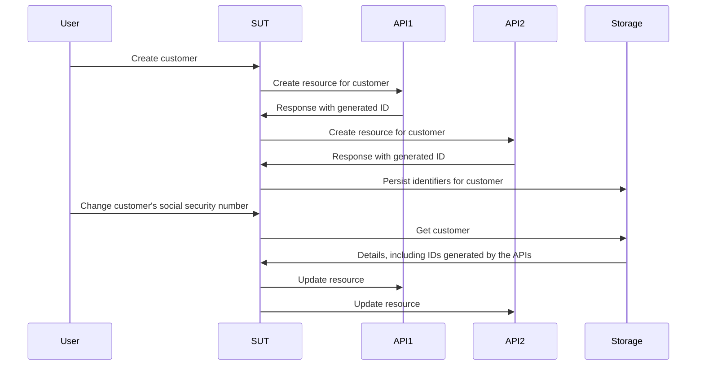

# العمل بدون الـ Mocks والـ Stubs والـ Spies

يتعمّق هذا الفصل في عالم الـ test doubles، ويستكشف كيف تؤثر في عملية الاختبار والتطوير. سنكشف حدود الـ mocks والـ stubs والـ spies التقليدية، ثم نقدّم نهجًا أكثر كفاءة وقابلية للتكيّف باستخدام الـ fakes والـ contracts.

## باختصار

- الـ Mocks والـ spies والـ stubs تشجعك على ترميز افتراضاتك حول سلوك اعتمادياتك بشكل ارتجالي (ad-hoc) في كل اختبار.
- وهذه الافتراضات لا يُتحقق منها عادةً إلا يدويًا، ما يهدد فائدة مجموعة اختباراتك.
- أما الـ fakes والـ contracts فتمنحاننا طريقة أكثر استدامة لإنشاء test doubles بافتراضات مُتحقق منها، وبإعادة استخدام أفضل من البدائل الأخرى.

هذا الفصل أطول من المعتاد، فلنأخذ نفسًا قصيرًا، ابدأ باستكشاف [مستودع الأمثلة](https://github.com/quii/go-fakes-and-contracts). وبالأخص، ألقِ نظرة على [اختبار planner](https://github.com/quii/go-fakes-and-contracts/blob/main/domain/planner/planner_test.go).

---

في فصل [الـ Mocking](../go-fundamentals/mocking.md)، تعلّمنا كيف تكون الـ mocks والـ stubs والـ spies أدوات مفيدة للتحكم في سلوك وحدات الكود وفحصه، إلى جانب [حقن الاعتماديات](../go-fundamentals/dependency-injection.md).

لكن مع نمو المشروع، *قد* تصبح هذه الأنواع من الـ test doubles عبئًا على الصيانة، ولذلك يجدر بنا البحث في أفكار تصميمية أخرى لإبقاء نظامنا سهل الاستدلال والاختبار.

تتيح **الـ fakes** و**الـ contracts** للمطورين اختبار أنظمتهم بسيناريوهات أكثر واقعية، وتحسين تجربة التطوير المحلية بحلقات تغذية راجعة أسرع وأدق، وإدارة تعقيد الاعتماديات المتطورة.

### تمهيد عن الـ test doubles

من السهل أن تتضايق عندما يتزمّت أشخاص مثلي في تسميات الـ test doubles، لكن الأنواع المختلفة منها تساعدنا على الحديث عن هذا الموضوع وعن المقايضات التي نقوم بها بوضوح.

**الـ Test doubles** لفظ جامع للطرق المختلفة التي تبني بها اعتماديات يمكنك التحكم فيها من أجل **موضوع تحت الاختبار** (subject under test) **(SUT)**، أي الشيء الذي تختبره. وغالبًا ما تكون الـ test doubles بديلًا أفضل من استخدام الاعتمادية الحقيقية، لأنها تتجنب مشكلات مثل:

- الحاجة إلى الإنترنت لاستخدام واجهة برمجية (API)
- تجنّب زمن الاستجابة (latency) ومشكلات الأداء الأخرى
- عدم القدرة على تجربة الحالات غير السعيدة (non-happy path)
- فصل عملية البناء لديك عن عملية بناء فريق آخر.
  - فلن ترغب في منع عمليات النشر لأن مهندسًا في فريق آخر شحن خطأً عن غير قصد

في Go، ستمثّل الاعتمادية عادةً بواجهة (interface)، ثم تنفّذ نسختك للتحكم في السلوك داخل الاختبار. **وفيما يلي أنواع الـ test doubles التي يتناولها هذا الفصل**.

هذه واجهة (interface) لواجهة برمجية افتراضية للوصفات (recipe API):

```go
type RecipeBook interface {
	GetRecipes() ([]Recipe, error)
	AddRecipes(...Recipe) error
}
```

يمكننا بناء الـ test doubles بطرق متنوعة، بحسب الطريقة التي نريد بها اختبار شيء يستخدم `RecipeBook`.

**الـ Stubs** تُرجع نفس البيانات الجاهزة (canned) في كل مرة تُستدعى فيها

```go
type StubRecipeStore struct {
	recipes []Recipe
	err     error
}

func (s *StubRecipeStore) GetRecipes() ([]Recipe, error) {
	return s.recipes, s.err
}

// AddRecipes omitted for brevity
```

```go
// in test, we can set up the stub to always return specific recipes, or an error
stubStore := &StubRecipeStore{
	recipes: someRecipes,
}
```

**الـ Spies** تشبه الـ stubs، لكنها تسجّل أيضًا كيفية استدعائها، حتى يستطيع الاختبار التحقق من أن الـ SUT يستدعي الاعتماديات بطرق معينة.

```go
type SpyRecipeStore struct {
	AddCalls [][]Recipe
	err      error
}

func (s *SpyRecipeStore) AddRecipes(r ...Recipe) error {
	s.AddCalls = append(s.AddCalls, r)
	return s.err
}

// GetRecipes omitted for brevity
```

```go
// in test
spyStore := &SpyRecipeStore{}
sut := NewThing(spyStore)
sut.DoStuff()

// now we can check the store had the right recipes added by inspectiong spyStore.AddCalls
```

**الـ Mocks** تشبه مجموعة شاملة (superset) مما سبق، لكنها لا تستجيب إلا ببيانات محددة لاستدعاءات محددة. وإذا استدعى الـ SUT الاعتماديات بوسائط خاطئة، فعادةً ما ينتهي الأمر بحالة panic.

```go
// set up the mock with expected calls
mockStore := &MockRecipeStore{}
mockStore.WhenCalledWith(someRecipes).Return(someError)

// when the sut uses the dependency, if it doesn't call it with someRecipes, usually mocks will panic
```

**الـ Fakes** تشبه نسخة حقيقية من الاعتمادية، لكنها مُنفَّذة بطريقة أنسب للاختبارات السريعة الموثوقة وللتطوير المحلي. فكثيرًا ما يكون في نظامك تجريد حول حفظ البيانات (persistence) يُنفَّذ بقاعدة بيانات، لكن في اختباراتك يمكنك استخدام fake يعمل في الذاكرة (in-memory) بدلًا من ذلك.

```go
type FakeRecipeStore struct {
	recipes []Recipe
}

func (f *FakeRecipeStore) GetRecipes() ([]Recipe, error) {
	return f.recipes, nil
}

func (f *FakeRecipeStore) AddRecipes(r ...Recipe) error {
	f.recipes = append(f.recipes, r...)
	return nil
}
```

الـ Fakes مفيدة لأن:

- كونها تحتفظ بالحالة (statefulness) مفيد للاختبارات التي تشمل أكثر من موضوع وأكثر من استدعاء، مثل اختبار التكامل (integration test). ويُنصح عمومًا بتجنّب إدارة الحالة مع الأنواع الأخرى من الـ test doubles.
- وإذا كانت تملك واجهة برمجية معقولة، فهي تقدّم طريقة أكثر طبيعية للتحقق من الحالة. فبدلًا من التجسس على استدعاءات معينة لاعتمادية ما، يمكنك الاستعلام عن حالتها النهائية لترى إن كان الأثر الحقيقي الذي تريده قد حدث.
- ويمكنك استخدامها لتشغيل تطبيقك محليًا دون تشغيل اعتماديات حقيقية أو الاعتماد عليها. وهذا يحسّن عادةً تجربة المطور (DX)، لأن الـ fakes ستكون أسرع وأكثر موثوقية من نظيراتها الحقيقية.

يمكن عادةً توليد الـ spies والـ mocks والـ stubs تلقائيًا من واجهة باستخدام أداة أو باستخدام الانعكاس (reflection). لكن لأن الـ fakes ترمّز سلوك الاعتمادية التي تحاول صنع بديل لها، فسيكون عليك كتابة معظم التنفيذ بنفسك على الأقل.

## مشكلة الـ stubs والـ mocks

في فصل [الأنماط المضادة (Anti-patterns)](../meta/anti-patterns.md)، توجد تفاصيل عن ضرورة استخدام الـ test doubles بعناية. فمن السهل أن تصنع مجموعة اختبارات فوضوية إذا لم تستخدمها بذوق. ومع نمو المشروع، يمكن أن تتسلل مشكلات أخرى.

عندما ترمّز السلوك في الـ test doubles، فأنت تضيف إلى الاختبار افتراضاتك عن كيفية عمل الاعتمادية الحقيقية. وإذا وُجد تباين بين سلوك البديل والاعتمادية الحقيقية، أو إذا ظهر هذا التباين بمرور الوقت (مثل تغيّر الاعتمادية الحقيقية، وهو أمر *لا بد* أن نتوقعه)، فقد **تحصل على اختبارات ناجحة لكن برمجية فاشلة**.

وتمثّل الـ stubs والـ spies والـ mocks على وجه الخصوص تحديات أخرى، خصوصًا مع نمو المشروع. ولتوضيح ذلك، سأصف مشروعًا عملت عليه.

### دراسة حالة كمثال

*غُيّرت بعض التفاصيل عمّا حدث فعلًا، وبُسّطت كثيرًا للإيجاز. **وأي تشابه مع أشخاص حقيقيين، أحياء أو أموات، هو محض صدفة.***

عملت على نظام كان عليه استدعاء **ست** واجهات برمجية (APIs) مختلفة، مكتوبة ومصانة من فرق أخرى حول العالم. وكانت _شبه REST_، ومهمة نظامنا إنشاء موارد فيها جميعًا وإدارتها. وعندما كنا نستدعي كل الواجهات استدعاءً صحيحًا لكل نظام، كان _السحر_ (القيمة التجارية) يحدث.

كان تطبيقنا مبنيًا بمعمارية سداسية (hexagonal) أو "منافذ ومهايئات" (ports & adapters). وكان كود المجال لدينا مفصولًا عن فوضى العالم الخارجي التي كان علينا التعامل معها. وكانت "مهايئاتنا" (adapters) في الواقع عملاء Go يغلّفون استدعاء الواجهات المختلفة.


#### المتاعب

بطبيعة الحال، اتبعنا نهجًا موجهًا بالاختبار في بناء النظام. واستفدنا من الـ stubs لمحاكاة استجابات الواجهات اللاحقة (downstream)، وكانت لدينا حفنة من اختبارات القبول لنطمئن أن كل شيء ينبغي أن يعمل.

إلا أن الواجهات التي كان علينا استدعاؤها كانت في معظمها:

- ضعيفة التوثيق
- يديرها فرق لديها أولويات وضغوط أخرى متضاربة كثيرة، فلم يكن من السهل الحصول على وقت معها
- غالبًا ما تفتقر إلى التغطية الاختبارية، فكانت تتعطل بطرق طريفة وغير متوقعة، وتتراجع، وما إلى ذلك
- كانت لا تزال قيد البناء والتطور

أدى ذلك إلى **كثير من الاختبارات المتقلبة** (flaky) وإلى الكثير من الصداع. فقد ذهبت _حصة كبيرة_ من وقتنا في مراسلة كثير من المشغولين على Slack محاولين الحصول على إجابات على أسئلة مثل:

- لماذا بدأت الواجهة تفعل `x`؟
- لماذا تفعل الواجهة شيئًا مختلفًا عندما نفعل `y`؟

نادرًا ما يكون تطوير البرمجيات مباشرًا كما تأمل؛ فهو تمرين تعلّمي. كان علينا أن نتعلّم باستمرار كيف تعمل الواجهات الخارجية. وبينما كنا نتعلم ونتكيف، كان علينا تحديث مجموعة اختباراتنا وإضافة إليها، وبالأخص **تغيير الـ stubs لدينا لتطابق السلوك الفعلي للواجهات.**

والمشكلة أن هذا كان يستهلك كثيرًا من وقتنا ويؤدي إلى مزيد من الأخطاء. فعندما تتغير معرفتك باعتمادية ما، يجب أن تجد الاختبار **الصحيح** لتحديثه وتغيير سلوك الـ stub، وهناك خطر حقيقي من إغفال تحديثه في stubs أخرى تمثّل الاعتمادية نفسها.

#### استراتيجية الاختبار

وفوق ذلك، مع نمو النظام وتغيّر المتطلبات، أدركنا أن استراتيجية اختبارنا غير مناسبة. كانت لدينا حفنة من اختبارات القبول تمنحنا الثقة أن النظام ككل يعمل، ثم عدد كبير من اختبارات الوحدة للحزم المختلفة التي كتبناها.

<u>كنا نحتاج شيئًا بين الاثنين</u>؛ فكثيرًا ما أردنا تغيير سلوك أجزاء مختلفة من النظام معًا **دون أن نضطر إلى تشغيل النظام *بالكامل* من أجل اختبار قبول**. ولم تمنحنا اختبارات الوحدة وحدها الثقة بأن المكونات المختلفة تعمل ككل؛ فلم تكن تستطيع أن تحكي (وتتحقق من) قصة ما نحاول إنجازه. **كنا نريد اختبارات تكامل**.

#### اختبارات التكامل

تثبت اختبارات التكامل أنّ وحدتين أو أكثر تعمل بشكل صحيح عند دمجها (أو تكاملها!). وهذه الوحدات قد تكون الكود الذي تكتبه، أو الكود الذي تكتبه مدمجًا مع كود شخص آخر، مثل قاعدة بيانات.

ومع نمو المشروع، سترغب في كتابة مزيد من اختبارات التكامل لتثبت أن أجزاء كبيرة من نظامك "تتماسك معًا" - أو تتكامل!

قد ترغب في كتابة مزيد من اختبارات القبول للصندوق الأسود، لكنها تصبح سريعًا مكلفة من حيث وقت البناء وتكاليف الصيانة. فقد يكون تشغيل نظام كامل مكلفًا للغاية عندما تريد فقط التحقق من أن *مجموعة فرعية* من النظام (وليست وحدة واحدة فقط) تتصرف كما ينبغي. وكتابة اختبارات صندوق أسود مكلفة لكل جزء من الوظائف التي تنفذها ليست مستدامة للأنظمة الأكبر.

#### وهنا تأتي الـ fakes

كانت المشكلة أن طريقة اختبار وحداتنا تعتمد على الـ stubs، وهي في معظمها *بلا حالة* (stateless). وكنا نريد كتابة اختبارات تغطي عدة استدعاءات *ذات حالة* (stateful) للواجهات، قد ننشئ فيها موردًا في البداية ثم نعدّله لاحقًا.

وفيما يلي نسخة مختصرة من اختبار أردنا إجراءه.

الـ SUT هنا "طبقة خدمة" (service layer) تتولى طلبات "حالات الاستخدام" (use cases). ونريد أن نثبت أنه عند إنشاء عميل، وعندما تتغير بياناته، ننجح في تحديث الموارد التي أنشأناها في الواجهات المعنية.

وهذه المتطلبات التي أُعطيت للفريق في صورة قصة مستخدم (user story).

> ***بفرض*** أن مستخدمًا مسجّل في الواجهات 1 و2 و3
>
> ***عندما*** يتغير رقم الضمان الاجتماعي للعميل
>
> ***فإن*** التغيير ينتقل إلى الواجهات 1 و2 و3



الاختبارات التي تمتد عبر وحدات متعددة لا تتوافق عادةً مع الـ stubs **لأنها لا تصلح للاحتفاظ بالحالة**. و*بوسعنا* كتابة اختبار قبول للصندوق الأسود، لكن تكاليف هذه الاختبارات كانت ستتضخم سريعًا حتى تخرج عن السيطرة.

إضافة إلى ذلك، يصعُب اختبار الحالات الطرفية (edge cases) باختبار صندوق أسود لأنك لا تستطيع التحكم في الاعتماديات. فقد أردنا مثلًا أن نثبت أن آلية التراجع (rollback) ستعمل إذا فشل استدعاء إحدى الواجهات.

كنا نحتاج إلى استخدام **الـ fakes**. فبتمثيل اعتمادياتنا كواجهات ذات حالة عبر fakes تعمل في الذاكرة، استطعنا كتابة اختبارات تكامل بنطاق أوسع بكثير، **لنتيح لأنفسنا اختبار أن حالات الاستخدام الحقيقية تعمل**، ومرة أخرى *دون* الحاجة إلى تشغيل النظام كله، وبسرعة تكاد تكون مماثلة لسرعة اختبارات الوحدة.


باستخدام الـ fakes، **نستطيع بناء تحققات على الحالات النهائية للأنظمة المعنية بدلًا من الاعتماد على تجسس معقد**. كنا نسأل كل fake عن السجلات التي يحتفظ بها للعميل، ونتحقق من أنها حُدّثت. وهذا يبدو أكثر طبيعية؛ فلو فحصنا نظامنا يدويًا لاستعلمنا من تلك الواجهات لنرى حالتها، لا أن نفحص سجلات طلباتنا لنعرف إن كنا أرسلنا حمولات JSON معينة.

```go
// take our lego-bricks and assemble the system for the test
fakeAPI1 := fakes.NewAPI1()
fakeAPI2 := fakes.NewAPI2() // etc..
customerService := customer.NewService(fakeAPI1, fakeAPI2, etc...)

// create new customer
newCustomerRequest := NewCustomerReq{
	// ...
}
createdCustomer, err := customerService.New(newCustomerRequest)
assert.NoErr(t, err)

// we can verify all the details are as expected in the various fakes in a natural way, as if they're normal APIs
fakeAPI1Customer := fakeAPI1.Get(createdCustomer.FakeAPI1Details.ID)
assert.Equal(t, fakeAPI1Customer.SocialSecurityNumber, newCustomerRequest.SocialSecurityNumber)

// repeat for the other apis we care about

// update customer
updatedCustomerRequest := NewUpdateReq{SocialSecurityNumber: "123", InternalID: createdCustomer.InternalID}
assert.NoErr(t, customerService.Update(updatedCustomerRequest))

// again we can check the various fakes to see if the state ends up how we want it
updatedFakeAPICustomer := fakeAPI1.Get(createdCustomer.FakeAPI1Details.ID)
assert.Equal(t, updatedFakeAPICustomer.SocialSecurityNumber, updatedCustomerRequest.SocialSecurityNumber)
```

هذا أبسط في الكتابة وأسهل في القراءة من فحص وسائط استدعاءات الدوال المتنوعة التي تُجرى عبر الـ spies.

يتيح لنا هذا النهج اختبارات تمتد عبر أجزاء واسعة من نظامنا، فنكتب اختبارات أكثر **معنى** عن حالات الاستخدام التي نناقشها في الاجتماع اليومي (stand-up)، مع بقائها سريعة التنفيذ للغاية.

#### الـ fakes تجلب مزيدًا من فوائد التغليف (encapsulation)

في المثال السابق، لم تكن الاختبارات تهتم بكيفية تصرف الاعتماديات إلا من حيث التحقق من حالتها النهائية. فقد أنشأنا النسخ المزيفة (fake) من الاعتماديات وحقنّاها في الجزء الذي نختبره من النظام.

أما مع الـ mocks/الـ stubs، فكان علينا إعداد كل اعتمادية لتتعامل مع سيناريوهات معينة، وتُرجع بيانات معينة، وما إلى ذلك. وهذا يجلب السلوك وتفاصيل التنفيذ إلى اختباراتك، فيُضعف فوائد التغليف.

نمثّل الاعتماديات خلف واجهات حتى *لا نضطر، بصفتنا عملاء، إلى الاهتمام بكيفية عملها*، لكن مع نهج "الـ mockist"، *نضطر إلى الاهتمام بها **في كل اختبار***.

#### تكاليف صيانة الـ fakes

الـ fakes أغلى من غيرها من الـ test doubles، على الأقل من ناحية الكود المكتوب؛ إذ يجب أن تحتفظ بالحالة وتحاكي سلوك الشيء الذي تمثله. وأي تباين في السلوك بين الـ fake لديك والشيء الحقيقي **يحمل خطرًا** أن اختباراتك ليست متوافقة مع الواقع. وهذا يقود إلى الحالة التي تكون فيها اختباراتك ناجحة لكن برمجيتك معطلة.

وكلما دمجت نظامك مع نظام آخر، سواء كان واجهة برمجية لفريق آخر أو قاعدة بيانات، فستبني افتراضات على سلوكه. وقد تأتي هذه الافتراضات من توثيق الواجهة، أو محادثات مباشرة، أو رسائل بريد إلكتروني، أو نقاشات Slack، وما إلى ذلك.

ألن يكون مفيدًا لو استطعنا **ترميز افتراضاتنا** وتشغيلها على كل من الـ fake لدينا *و*النظام الفعلي لنرى إن كانت معرفتنا صحيحة بطريقة قابلة للتكرار وموثقة؟

**الـ Contracts** هي الوسيلة إلى ذلك. فقد ساعدتنا على إدارة الافتراضات التي بنيناها على أنظمة الفريق الآخر وجعلها صريحة. صريحة ومفيدة أكثر بكثير من تبادل رسائل البريد الإلكتروني أو سلاسل Slack التي لا تنتهي!


بوجود contract، يمكننا افتراض أننا نستطيع استخدام الـ fake والاعتمادية الفعلية بالتبادل. وهذا مفيد ليس فقط لبناء الاختبارات، بل للتطوير المحلي أيضًا.

وهذا مثال على contract لإحدى الواجهات التي يعتمد عليها النظام

```go
type API1Customer struct {
	Name string
	ID   string
}

type API1 interface {
	CreateCustomer(ctx context.Context, name string) (API1Customer, error)
	GetCustomer(ctx context.Context, id string) (API1Customer, error)
	UpdateCustomer(ctx context.Context, id string, name string) error
}

type API1Contract struct {
	NewAPI1 func() API1
}

func (c API1Contract) Test(t *testing.T) {
	t.Run("can create, get and update a customer", func(t *testing.T) {
		var (
			ctx  = context.Background()
			sut  = c.NewAPI1()
			name = "Bob"
		)

		customer, err := sut.CreateCustomer(ctx, name)
		expect.NoErr(t, err)

		got, err := sut.GetCustomer(ctx, customer.ID)
		expect.NoErr(t, err)
		expect.Equal(t, customer, got)

		newName := "Robert"
		expect.NoErr(t, sut.UpdateCustomer(ctx, customer.ID, newName))

		got, err = sut.GetCustomer(ctx, customer.ID)
		expect.NoErr(t, err)
		expect.Equal(t, newName, got.Name)
	})

	// example of strange behaviours we didn't expect
	t.Run("the system will not allow you to add 'Dave' as a customer", func(t *testing.T) {
		var (
			ctx  = context.Background()
			sut  = c.NewAPI1()
			name = "Dave"
		)

		_, err := sut.CreateCustomer(ctx, name)
		expect.Err(t, ErrDaveIsForbidden)
	})
}
```

وكما نوقش في فصل [توسيع نطاق اختبارات القبول](scaling-acceptance-tests.md)، فباختبار واجهة بدلًا من نوع ملموس (concrete type)، يصبح الاختبار:

- مفصولًا عن تفاصيل التنفيذ
- وقابلًا لإعادة الاستخدام في سياقات مختلفة.

وهذان هما شرطا الـ contract. فهو يتيح لنا التحقق من الـ fake وتطويره، *و*اختباره مقابل التنفيذ الفعلي.

ولإنشاء الـ fake الذي يعمل في الذاكرة، يمكننا استخدام الـ contract في اختبار.

```go
func TestInMemoryAPI1(t *testing.T) {
	API1Contract{NewAPI1: func() API1 {
		return inmemory.NewAPI1()
	}}.Test(t)
}
```

وهذا كود الـ fake

```go
func NewAPI1() *API1 {
	return &API1{customers: make(map[string]planner.API1Customer)}
}

type API1 struct {
	i         int
	customers map[string]planner.API1Customer
}

func (a *API1) CreateCustomer(ctx context.Context, name string) (planner.API1Customer, error) {
	if name == "Dave" {
		return planner.API1Customer{}, ErrDaveIsForbidden
	}

	newCustomer := planner.API1Customer{
		Name: name,
		ID:   strconv.Itoa(a.i),
	}
	a.customers[newCustomer.ID] = newCustomer
	a.i++
	return newCustomer, nil
}

func (a *API1) GetCustomer(ctx context.Context, id string) (planner.API1Customer, error) {
	return a.customers[id], nil
}

func (a *API1) UpdateCustomer(ctx context.Context, id string, name string) error {
	customer := a.customers[id]
	customer.Name = name
	a.customers[id] = customer
	return nil
}
```

### برمجية تتطور

معظم البرمجيات لا تُبنى وتُنجز نهائيًا في إصدار واحد.

إنها تمرين تعلّمي تدريجي، يتكيف مع متطلبات العملاء والتغيرات الخارجية الأخرى. في المثال، كانت الواجهات التي نستدعيها تتطور وتتغير أيضًا؛ وإضافة إلى ذلك، بينما كنا نطوّر *برمجيتنا*، تعلمنا أكثر عن النظام الذي *نحتاج* فعلًا إلى بنائه. وتبيّن أن افتراضاتنا في الـ contracts كانت خاطئة، أو *أصبحت* خاطئة لاحقًا.

ولحسن الحظ، بعد أن أُعدّت الـ contracts، صار لدينا طريق بسيط للتعامل مع التغيير. فكلما تعلمنا شيئًا جديدًا، نتيجة إصلاح خطأ أو إخبار زميل لنا بأن الواجهة تتغير، كنا:

1. نكتب اختبارًا يمارس السيناريو الجديد. وسيشمل جزء من ذلك تغيير الـ contract بحيث **يقودك** إلى محاكاة السلوك في الـ fake
2. سيفشل الاختبار عند تشغيله، لكن قبل أي شيء آخر، شغّل الـ contract على الاعتمادية الحقيقية للتأكد أن التغيير في الـ contract صحيح.
3. نحدّث الـ fake ليتوافق مع الـ contract.
4. نجعل الاختبار ينجح.
5. نعيد الهيكلة.
6. نشغّل كل الاختبارات وننشر.

قد يؤدي تشغيل مجموعة الاختبارات *كاملة* قبل الحفظ إلى فشل اختبارات أخرى بسبب اختلاف سلوك الـ fake. وهذا **شيء جيد**!  إذ تستطيع الآن إصلاح كل الأجزاء الأخرى من النظام التي تعتمد على النظام المتغيّر، واثقًا أنها ستتعامل هي أيضًا مع هذا السيناريو في الإنتاج. وبدون هذا النهج، سيكون عليك أن *تتذكر* العثور على كل الاختبارات ذات الصلة وتحديث الـ stubs. أمر عرضة للخطأ ومرهق وممل.

### تجربة مطوّر فائقة

كان وجود مجموعة الـ fakes مع contracts مناظرة لها أشبه بقدرة خارقة. فقد استطعنا أخيرًا ترويض تعقيد الواجهات التي كان علينا التعامل معها.

وصارت كتابة الاختبارات لسيناريوهات مختلفة أبسط بكثير. فلم نعد مضطرين إلى تجميع سلسلة من الـ stubs والـ spies لكل اختبار؛ كان بإمكاننا أخذ مجموعتنا من الوحدات أو الوحدات النمطية (الـ fakes، و"الخدمات" التي كتبناها) وتجميعها بسهولة بالغة لممارسة مختلف السيناريوهات الغريبة الرائعة التي نحتاجها.

كل اختبار يستخدم stub أو spy أو mock *مضطر* إلى الاهتمام بكيفية تصرف النظام الخارجي، بسبب الإعداد الارتجالي. في المقابل، يمكن التعامل مع الـ fakes كأي وحدة كود أخرى جيدة التغليف، حيث تكون التفاصيل مخفية عنك، ويكفي أن تستخدمها.

استطعنا تشغيل نسخة واقعية جدًا من النظام محليًا، ولأن كل شيء كان في الذاكرة، كان يبدأ ويعمل بسرعة فائقة. وهذا يعني أن أوقات اختباراتنا كانت سريعة للغاية، وكان ذلك مثيرًا للإعجاب نظرًا إلى شمولية المجموعة.

وإذا فشلت اختبارات القبول في بيئة الاختبار التجريبية (staging)، كانت خطوتنا الأولى هي تشغيل الـ contracts على الواجهات التي نعتمد عليها. وكثيرًا ما كنا نكتشف المشكلات **قبل أن يكتشفها مطورو الأنظمة الأخرى أنفسهم**.

### الخروج عن المسار السعيد باستخدام الـ decorators

في سيناريوهات الخطأ، تكون الـ stubs أكثر ملاءمة لأنك تملك وصولًا مباشرًا إلى *كيفية* تصرفها في الاختبار، بينما تميل الـ fakes إلى أن تكون أقرب إلى الصندوق الأسود. وهذا خيار تصميمي متعمد، فنحن نريد لمن يستخدمها (مثل الاختبارات) ألا يهتم بكيفية عملها؛ بل ينبغي أن يثق بأنها تفعل الصواب بفضل دعم الـ contract.

فكيف نجعل الـ fakes تفشل، لممارسة الاهتمامات غير السعيدة (non-happy path)؟

توجد سيناريوهات كثيرة تحتاج فيها، بصفتك مطورًا، إلى تعديل سلوك كود ما دون تغيير مصدره. و**نمط الـ Decorator** طريقة شائعة لأخذ وحدة كود وإضافة أشياء مثل التسجيل (logging) والقياسات (telemetry) وإعادة المحاولات (retries) وغيرها. ويمكننا استخدامه لتغليف الـ fakes وتجاوز سلوكيات معينة عند الحاجة.

وبالعودة إلى مثال `API1`، يمكننا إنشاء نوع ينفّذ الواجهة المطلوبة ويلتف حول الـ fake.

```go
type API1Decorator struct {
	delegate           API1
	CreateCustomerFunc func(ctx context.Context, name string) (API1Customer, error)
	GetCustomerFunc    func(ctx context.Context, id string) (API1Customer, error)
	UpdateCustomerFunc func(ctx context.Context, id string, name string) error
}

// assert API1Decorator implements API1
var _ API1 = &API1Decorator{}

func NewAPI1Decorator(delegate API1) *API1Decorator {
	return &API1Decorator{delegate: delegate}
}

func (a *API1Decorator) CreateCustomer(ctx context.Context, name string) (API1Customer, error) {
	if a.CreateCustomerFunc != nil {
		return a.CreateCustomerFunc(ctx, name)
	}
	return a.delegate.CreateCustomer(ctx, name)
}

func (a *API1Decorator) GetCustomer(ctx context.Context, id string) (API1Customer, error) {
	if a.GetCustomerFunc != nil {
		return a.GetCustomerFunc(ctx, id)
	}
	return a.delegate.GetCustomer(ctx, id)
}

func (a *API1Decorator) UpdateCustomer(ctx context.Context, id string, name string) error {
	if a.UpdateCustomerFunc != nil {
		return a.UpdateCustomerFunc(ctx, id, name)
	}
	return a.delegate.UpdateCustomer(ctx, id, name)
}
```

وفي اختباراتنا، يمكننا بعدها استخدام حقل `XXXFunc` لتعديل سلوك الـ test double، تمامًا كما تفعل مع الـ stubs أو الـ spies أو الـ mocks.

```go
failingAPI1 = NewAPI1Decorator(inmemory.NewAPI1())
failingAPI1.UpdateCustomerFunc = func(ctx context.Context, id string, name string) error {
	return errors.New("failed to update customer")
}
```

لكن هذا *مزعج* فعلًا ويتطلب منك بعض التقدير. فبهذا النهج تخسر الضمانات التي يقدمها الـ contract، لأنك تُدخل سلوكًا ارتجاليًا إلى الـ fake في الاختبارات.

من الأفضل أن تتأمل سياقك؛ فقد تخلص إلى أن اختبار مسارات غير سعيدة معينة على مستوى اختبار الوحدة باستخدام stub سيكون أبسط.

### أليس هذا الكود الإضافي هدرًا؟

من الأماني أن نعتقد أنه ينبغي ألا نكتب إلا كودًا يخدم العملاء، ثم نتوقع نظامًا نستطيع البناء عليه بكفاءة. وللناس رأي مشوّه جدًا في معنى الهدر (انظر مقالي: [شبح هنري فورد يخرّب فريق التطوير لديك](https://quii.dev/The_ghost_of_Henry_Ford_is_ruining_your_development_team)).

لا تفيد الاختبارات الآلية العملاء مباشرة، لكننا نكتبها لنصبح أكثر كفاءة في عملنا (أنت لا تكتب الاختبارات لمطاردة درجات التغطية، أليس كذلك؟).

يحتاج المهندسون إلى محاكاة السيناريوهات بسهولة (بطريقة قابلة للتكرار، لا ارتجالية) لتنقيح المشكلات واختبارها وإصلاحها. **والـ fakes التي تعمل في الذاكرة مع تصميم نمطي جيد تتيح لنا عزل الأطراف المعنية بسيناريو ما لكتابة اختبارات سريعة ومناسبة بتكلفة زهيدة للغاية**. وتمنح هذه المرونة المطورين القدرة على تطوير النظام بطريقة أسهل بكثير من كتلة متشابكة تُختبر باختبارات صندوق أسود مكلفة في كتابتها وتشغيلها، أو الأسوأ من ذلك، بالاختبار اليدوي على بيئة مشتركة.

وهذا مثال على [البسيط مقابل السهل](https://www.youtube.com/watch?v=SxdOUGdseq4). بطبيعة الحال، ستؤدي الـ fakes والـ contracts إلى كتابة كود أكثر من الـ stubs والـ spies على المدى القصير، لكن النتيجة نظام أبسط وأرخص في الصيانة على المدى الطويل. أما تحديث الـ spies والـ stubs والـ mocks على طريقة الترقيع فيستهلك جهدًا كبيرًا وهو عرضة للخطأ، لأنك لن تملك contracts مناظرة تتحقق بها أن test doubles لديك تتصرف تصرفًا صحيحًا.

يمثل هذا النهج تكلفة أولية *أعلى قليلًا*، لكن التكاليف تصبح أقل بكثير بمجرد إعداد الـ contracts والـ fakes. فالـ fakes أكثر قابلية لإعادة الاستخدام وأكثر موثوقية من الـ test doubles الارتجالية مثل الـ stubs.

وهو شعور *محرر جدًا* ويمنحك **ثقة** عندما تستخدم fake موجودًا ومجرّبًا في المعارك بدلًا من إعداد stub عند كتابة اختبار جديد.

### كيف يتلاءم هذا مع TDD؟

لا أنصح *بالبدء* من الـ contract؛ فهذا تصميم من الأسفل إلى الأعلى (bottom-up)، وهو تصميم أجد نفسي عمومًا بحاجة إلى ذكاء أكبر فيه، وفيه خطر أن أفرط في التفكير في متطلبات افتراضية.

تتوافق هذه التقنية مع "النهج الموجّه باختبارات القبول" كما نوقش في فصول سابقة، وفي [لماذا TDD](https://quii.dev/The_Why_of_TDD) وفي كتاب [GOOS](http://www.growing-object-oriented-software.com)

- اكتب [اختبار قبول](scaling-acceptance-tests.md) فاشلًا.
- استخرج كودًا كافيًا لنجاحه، وعادةً سينتج عن ذلك "طبقة خدمة" تعتمد على واجهة برمجية أو قاعدة بيانات أو ما شابه. وغالبًا سيكون لديك كود منطق أعمال مفصول عن الاهتمامات الخارجية (مثل حفظ البيانات والاتصال بقاعدة بيانات، إلخ) عبر واجهة.
- نفّذ الواجهة أولًا بـ fake يعمل في الذاكرة لتصبح كل الاختبارات ناجحة محليًا، ولتتحقق من التصميم الأولي.
- وللدفع إلى الإنتاج، لا يمكنك استخدام نسخة في الذاكرة! لذا رمّز الافتراضات التي بنيتها على الـ fake في contract.
- استخدم الـ contract لإنشاء الاعتمادية الفعلية، مثل نسخة MySQL من المخزن (store).
- انشر.

## أين فصل اختبار قواعد البيانات؟

كان هذا طلبًا شائعًا أرجأته أكثر من خمس سنوات. والسبب أن هذا الفصل سيكون دائمًا هو جوابي.

<u>لا تعمل mock لسائق قاعدة البيانات ولا تتجسس على الاستدعاءات</u>. فهذه الاختبارات صعبة الكتابة وقد تحمل قيمة قليلة جدًا. ولا ينبغي أن تتحقق مما إذا كانت عبارة `SQL` معينة قد أُرسلت إلى قاعدة البيانات، فهذا تفصيل من تفاصيل التنفيذ؛ **وينبغي أن تهتم اختباراتك بالسلوك فقط**. فإثبات أن عبارة SQL معينة قد جُمعت (compiled) *لا* يثبت أن كودك *يتصرف* كما تحتاج.

**الـ Contracts** تجبرك على فصل اختباراتك عن تفاصيل التنفيذ والتركيز على السلوك.

اتبع نهج TDD الموصوف أعلاه لاستخراج احتياجاتك في حفظ البيانات.

[مستودع الأمثلة](https://github.com/quii/go-fakes-and-contracts) فيه أمثلة على الـ contracts، وكيف تُستخدم لاختبار تنفيذات تعمل في الذاكرة وأخرى بـ SQLite لبعض احتياجات حفظ البيانات.

```go
package inmemory_test

import (
	"github.com/quii/go-fakes-and-contracts/adapters/driven/persistence/inmemory"
	"github.com/quii/go-fakes-and-contracts/domain/planner"
	"testing"
)

func TestInMemoryPantry(t *testing.T) {
	planner.PantryContract{
		NewPantry: func() planner.Pantry {
			return inmemory.NewPantry()
		},
	}.Test(t)
}
```

```go
package sqlite_test

import (
	"github.com/quii/go-fakes-and-contracts/adapters/driven/persistence/sqlite"
	"github.com/quii/go-fakes-and-contracts/domain/planner"
	"testing"
)

func TestSQLitePantry(t *testing.T) {
	client := sqlite.NewSQLiteClient()
	t.Cleanup(func() {
		if err := client.Close(); err != nil {
			t.Error(err)
		}
	})

	planner.PantryContract{
		NewPantry: func() planner.Pantry {
			return sqlite.NewPantry(client)
		},
	}.Test(t)
}
```

ومع أن Docker وأمثاله *يُسهّلون* تشغيل قواعد البيانات محليًا، فقد يحملون مع ذلك عبئًا كبيرًا على الأداء. وتتيح لك الـ fakes مع الـ contracts حصر الحاجة إلى الاعتمادية "الأثقل" في أوقات التحقق من الـ contract فقط، دون الحاجة إليها في أنواع الاختبارات الأخرى.

ويوفّر استخدام الـ fakes التي تعمل في الذاكرة في اختبارات القبول والتكامل لـ*بقية* النظام تجربة مطوّر أسرع وأبسط بكثير.

## الخلاصة

من الشائع أن تُنظَّم مشاريع البرمجيات بفرق مختلفة تبني أنظمة في الوقت نفسه سعيًا إلى هدف مشترك.

تتطلب طريقة العمل هذه قدرًا كبيرًا من التعاون والتواصل. ويرى كثيرون أن نهج "الواجهة البرمجية أولًا" (API first) يتيح لنا تعريف بعض contracts الواجهات (على صفحة wiki غالبًا!) ثم العمل باستقلالية ستة أشهر ونجمع كل شيء في النهاية. ونادرًا ما ينجح هذا في الواقع، لأننا حين نبدأ كتابة الكود نفهم المجال والمشكلة فهمًا أفضل، ما يتحدى افتراضاتنا. وعلينا أن نتفاعل مع هذه التغيرات في المعرفة، وهي تتطلب غالبًا تغييرات عابرة للفرق.

لذا، إذا كنت في هذا الموقف، فأنت بحاجة إلى هيكلة نظامك واختباره على النحو الأمثل للتعامل مع التغيّرات غير المتوقعة، داخل النظام الذي تعمل عليه وخارجه.

> "من الخصائص المميزة للفرق عالية الأداء في تطوير البرمجيات قدرتها على إحراز تقدم وتغيير رأيها دون طلب إذن من أي شخص أو مجموعة خارج فريقها الصغير."
>
> Modern Software Engineering
> David Farley

لا تعتمد على الاجتماعات الأسبوعية أو سلاسل Slack لتوضيح التغييرات. **رمّز افتراضاتك في contracts**. وشغّل تلك الـ contracts على الأنظمة في خطوط بناءك (build pipelines) لتحصل على تغذية راجعة سريعة إذا ظهرت معلومات جديدة. وهذه الـ contracts، مع **الـ fakes**، تعني أنك تستطيع العمل باستقلالية وإدارة التغييرات الخارجية بشكل مستدام.

### نظامك كمجموعة من الوحدات النمطية

وبالعودة إلى كتاب Farley، فأنا أصف فكرة **التدريجية** (incrementalism). فبناء البرمجيات *تمرين تعلّمي دائم*. ومن غير الواقعي أن نفهم مسبقًا المتطلبات التي يجب أن نحلها في نظام ما لتقديم قيمة. لذا علينا تحسين أنظمتنا وطرق عملنا **لجمع التغذية الراجعة سريعًا والتجريب**.

تحتاج إلى **نظام نمطي (modular)** للاستفادة من الأفكار التي نوقشت في هذا الفصل. فإذا كان لديك كود نمطي مع fakes موثوقة، فسيتيح لك ذلك التجريب على نظامك عبر اختبارات آلية بتكلفة زهيدة.

وجدنا أنه من السهل جدًا ترجمة سيناريوهات غريبة افتراضية (لكنها ممكنة) إلى اختبارات مكتفية بذاتها تساعدنا على فهم المشكلة واستخراج برمجية أكثر متانة، وذلك بتركيب وحداتنا النمطية معًا وتجربة بيانات مختلفة بترتيب مختلف، مع فشل بعض الواجهات، وما إلى ذلك.

والوحدات النمطية المحددة تحديدًا جيدًا والمختبَرة جيدًا تتيح لك تطوير نظامك تدريجيًا دون تغيير *كل شيء* وفهمه دفعة واحدة.

### لكنني أعمل على شيء صغير بواجهات برمجية مستقرة

حتى مع الواجهات البرمجية المستقرة، لا تريد أن تكون تجربة المطوّر لديك وعمليات البناء وما إلى ذلك مرتبطة ارتباطًا وثيقًا بكود الآخرين. وعندما تتقن هذا النهج، ينتهي بك الأمر إلى مجموعة قابلة للتركيب من الوحدات النمطية التي تجمّع بها نظامك للإنتاج، وللتشغيل محليًا، ولبناء أنواع مختلفة من الاختبارات ببدائل تثق بها.

فهو يتيح لك عزل الأجزاء التي تهمك من نظامك وكتابة اختبارات ذات معنى عن المشكلة الحقيقية التي تحاول حلها.

### اجعل اعتمادياتك مواطنين من الدرجة الأولى.

بطبيعة الحال، للـ stubs والـ spies مكانتهما. ومحاكاة سلوكيات مختلفة لاعتمادياتك بشكل ارتجالي في الاختبارات سيكون لها دائمًا استخدامها، لكن احرص ألا تخرج التكاليف عن السيطرة.

رأيت في مسيرتي مرات كثيرة برمجيات مكتوبة بعناية من مطورين موهوبين تنهار بسبب مشكلات التكامل. فالتكامل صعب على المهندسين *لأنه* من العسير إعادة إنتاج السلوكيات الدقيقة لنظام كتبه مهندسون آخرون، وهم يغيّرونه في الوقت نفسه أيضًا.

تعتمد بعض الفرق على أن ينشر الجميع إلى بيئة مشتركة ويختبروا هناك. والمشكلة أن هذا لا يمنحك تغذية راجعة **معزولة**، كما أن **التغذية الراجعة بطيئة**. وستظل عاجزًا عن بناء تجارب مختلفة لطريقة عمل نظامك مع اعتماديات أخرى، أو على الأقل لن تفعل ذلك بكفاءة.

**علينا ترويض هذا التعقيد بتبنّي طرق أكثر تطورًا لتمثيل اعتمادياتنا** لنختبر ونجرّب سريعًا على أجهزة التطوير قبل وصول الأمر إلى الإنتاج. أنشئ fakes واقعية وسهلة الإدارة لاعتمادياتك، موثقة بـ contracts. وبعدها يمكنك البدء في كتابة اختبارات أكثر معنى والتجريب على نظامك، ما يزيد احتمال نجاحك.
